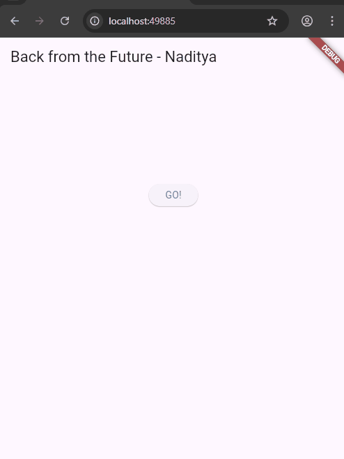

# 🧪 Laporan Praktikum Pemrograman Asynchronous di Flutter  
**Nama:** Naditya Prastia Andino  
**NIM:** 244107023008  
**No Absen:** 23  
**Kelas:** TI-3H  

---

## 📌 Soal Praktikum

### ✅ Soal 1  
Tambahkan nama panggilan Anda pada title app sebagai identitas hasil pekerjaan Anda.

### ✅ Soal 2  
Carilah judul buku favorit Anda di Google Books, lalu ganti ID buku pada variabel `path` di kode tersebut.  
Lakukan capture hasil JSON dan tulis di README  
Commit dengan pesan: `"W11: Soal 2"`

### ✅ Soal 3  
Jelaskan maksud kode pada langkah `ElevatedButton` terkait penggunaan `substring` dan `catchError`.  
Lampirkan hasil berupa GIF di README.  
Commit dengan pesan: `"W11: Soal 3"`

* **`substring(0, 300)`** digunakan untuk **memotong hasil data JSON** agar tidak terlalu panjang saat ditampilkan di layar (hanya menampilkan 300 karakter pertama).
* **`catchError`** digunakan untuk **menangani error** jika proses pengambilan data dari API gagal (misalnya karena koneksi atau URL salah), supaya aplikasi tidak crash dan menampilkan pesan kesalahan yang jelas.

---