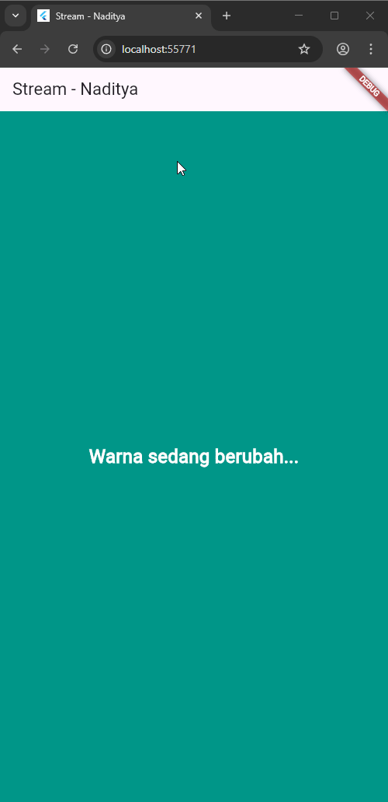

## 🧭 **W12: Jawaban Soal Praktikum Stream Flutter**

### 💡 **Soal 1**

> **Perintah:**
> Tambahkan nama panggilan Anda pada title app sebagai identitas hasil pekerjaan Anda.
> Gantilah warna tema aplikasi sesuai kesukaan Anda.
> Lakukan commit hasil jawaban Soal 1 dengan pesan:
> `"W12: Jawaban Soal 1"`

**Jawaban:**

```dart
import 'package:flutter/material.dart';

void main() {
  runApp(const MyApp());
}

class MyApp extends StatelessWidget {
  const MyApp({super.key});

  @override
  Widget build(BuildContext context) {
    return MaterialApp(
      title: 'Color Stream - Naditya', // ✅ Tambahkan nama panggilan
      theme: ThemeData(
        primarySwatch: Colors.teal, // ✅ Ubah warna tema sesuai kesukaan
      ),
      home: const Scaffold(
        body: Center(
          child: Text(
            'Selamat Datang di Color Stream!',
            style: TextStyle(fontSize: 20),
          ),
        ),
      ),
    );
  }
}
```
---

### 💡 **Soal 2**

> **Perintah:**
> Tambahkan 5 warna lainnya sesuai keinginan Anda pada variabel `colors` tersebut.
> Lakukan commit hasil jawaban Soal 2 dengan pesan:
> `"W12: Jawaban Soal 2"`

**Jawaban:**

```dart
import 'package:flutter/material.dart';

class ColorStream {
  final List<Color> colors = [
    Colors.blueGrey,
    Colors.amber,
    Colors.deepPurple,
    Colors.lightBlue,
    Colors.teal,
    Colors.red,       // tambahan 1
    Colors.green,     // tambahan 2
    Colors.orange,    // tambahan 3
    Colors.pink,      // tambahan 4
    Colors.indigo,    // tambahan 5
  ];

  Stream<Color> getColors() async* {
    yield* Stream.periodic(
      const Duration(seconds: 1),
      (int t) {
        int index = t % colors.length;
        return colors[index];
      },
    );
  }
}
```
---

### 💡 **Soal 3**

> **Perintah:**
> Jelaskan fungsi keyword `yield*` pada kode tersebut!
> Apa maksud isi perintah kode tersebut?
> Lakukan commit hasil jawaban Soal 3 dengan pesan:
> `"W12: Jawaban Soal 3"`

**Jawaban:**

#### 🔹 Fungsi `yield*`

`yield*` digunakan untuk **meneruskan seluruh elemen dari stream lain** ke dalam stream utama.
Artinya, bukan hanya mengirim satu nilai (`yield`), tetapi mengalirkan *stream* lengkap dari sumber lain seperti `Stream.periodic()`.

Contoh:

```dart
yield* Stream.periodic(...);
```

👉 berarti kita “menyambungkan” aliran data dari `Stream.periodic()` ke stream yang sedang dibuat oleh `getColors()`.

#### 🔹 Maksud isi perintah kode

```dart
yield* Stream.periodic(
  const Duration(seconds: 1),
  (int t) {
    int index = t % colors.length;
    return colors[index];
});
```

Penjelasan baris demi baris:

* `Stream.periodic(Duration(seconds: 1), ...)` → membuat stream yang **mengirim data setiap 1 detik**.
* `(int t)` → parameter penghitung waktu (0, 1, 2, 3, ...).
* `t % colors.length` → agar indeks warna terus berputar dari awal ke akhir (looping).
* `return colors[index];` → mengirim warna sesuai urutan dari daftar warna.
* `yield*` → meneruskan seluruh aliran warna ke stream utama agar bisa ditampilkan di UI secara real-time.

Jadi, fungsi ini akan **menghasilkan warna baru setiap detik secara berulang**, dan stream-nya bisa digunakan oleh widget Flutter untuk mengganti warna tampilan secara otomatis.

---

### 💡 **Soal 4**

Capture hasil praktikum Anda berupa GIF dan lampirkan di README.




