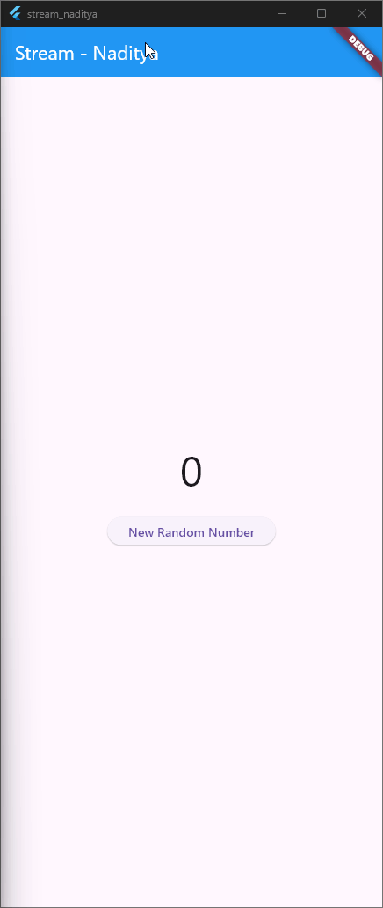
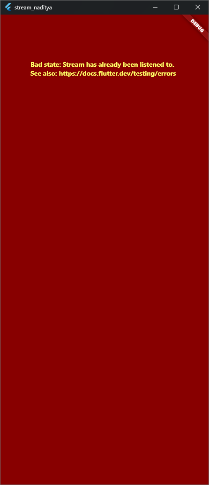
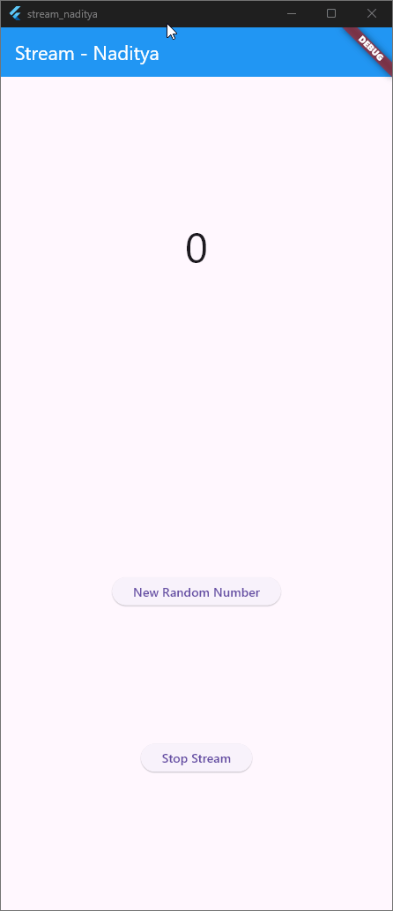

## 🧭 **W12: Jawaban Soal Praktikum Stream Flutter**

### 💡 **Soal 1**

> **Perintah:**
> Tambahkan nama panggilan Anda pada title app sebagai identitas hasil pekerjaan Anda.
> Gantilah warna tema aplikasi sesuai kesukaan Anda.
> Lakukan commit hasil jawaban Soal 1 dengan pesan:
> `"W12: Jawaban Soal 1"`

**Jawaban:**

```dart
import 'package:flutter/material.dart';

void main() {
  runApp(const MyApp());
}

class MyApp extends StatelessWidget {
  const MyApp({super.key});

  @override
  Widget build(BuildContext context) {
    return MaterialApp(
      title: 'Color Stream - Naditya', // ✅ Tambahkan nama panggilan
      theme: ThemeData(
        primarySwatch: Colors.teal, // ✅ Ubah warna tema sesuai kesukaan
      ),
      home: const Scaffold(
        body: Center(
          child: Text(
            'Selamat Datang di Color Stream!',
            style: TextStyle(fontSize: 20),
          ),
        ),
      ),
    );
  }
}
```
---

### 💡 **Soal 2**

> **Perintah:**
> Tambahkan 5 warna lainnya sesuai keinginan Anda pada variabel `colors` tersebut.
> Lakukan commit hasil jawaban Soal 2 dengan pesan:
> `"W12: Jawaban Soal 2"`

**Jawaban:**

```dart
import 'package:flutter/material.dart';

class ColorStream {
  final List<Color> colors = [
    Colors.blueGrey,
    Colors.amber,
    Colors.deepPurple,
    Colors.lightBlue,
    Colors.teal,
    Colors.red,       // tambahan 1
    Colors.green,     // tambahan 2
    Colors.orange,    // tambahan 3
    Colors.pink,      // tambahan 4
    Colors.indigo,    // tambahan 5
  ];

  Stream<Color> getColors() async* {
    yield* Stream.periodic(
      const Duration(seconds: 1),
      (int t) {
        int index = t % colors.length;
        return colors[index];
      },
    );
  }
}
```
---

### 💡 **Soal 3**

> **Perintah:**
> Jelaskan fungsi keyword `yield*` pada kode tersebut!
> Apa maksud isi perintah kode tersebut?
> Lakukan commit hasil jawaban Soal 3 dengan pesan:
> `"W12: Jawaban Soal 3"`

**Jawaban:**

#### 🔹 Fungsi `yield*`

`yield*` digunakan untuk **meneruskan seluruh elemen dari stream lain** ke dalam stream utama.
Artinya, bukan hanya mengirim satu nilai (`yield`), tetapi mengalirkan *stream* lengkap dari sumber lain seperti `Stream.periodic()`.

Contoh:

```dart
yield* Stream.periodic(...);
```

👉 berarti kita “menyambungkan” aliran data dari `Stream.periodic()` ke stream yang sedang dibuat oleh `getColors()`.

#### 🔹 Maksud isi perintah kode

```dart
yield* Stream.periodic(
  const Duration(seconds: 1),
  (int t) {
    int index = t % colors.length;
    return colors[index];
});
```

Penjelasan baris demi baris:

* `Stream.periodic(Duration(seconds: 1), ...)` → membuat stream yang **mengirim data setiap 1 detik**.
* `(int t)` → parameter penghitung waktu (0, 1, 2, 3, ...).
* `t % colors.length` → agar indeks warna terus berputar dari awal ke akhir (looping).
* `return colors[index];` → mengirim warna sesuai urutan dari daftar warna.
* `yield*` → meneruskan seluruh aliran warna ke stream utama agar bisa ditampilkan di UI secara real-time.

Jadi, fungsi ini akan **menghasilkan warna baru setiap detik secara berulang**, dan stream-nya bisa digunakan oleh widget Flutter untuk mengganti warna tampilan secara otomatis.

---

### 💡 **Soal 4**

Capture hasil praktikum Anda berupa GIF dan lampirkan di README.


### 💡 **Soal 5**

Jelaskan perbedaan menggunakan `listen` dan `await for` (Langkah 9):

| Pendekatan     | Penjelasan                                                                 |
|----------------|----------------------------------------------------------------------------|
| `await for`    | Digunakan dalam fungsi `async`, menunggu setiap event dari stream satu per satu. Cocok untuk alur linear dan sederhana. |
| `listen`       | Menggunakan callback untuk setiap event stream. Lebih fleksibel, bisa di-cancel, pause, atau resume. Cocok untuk kontrol lanjutan. |

🔍 **Perbandingan Teknis:**

- `await for`:
  - Lebih mudah dibaca untuk alur sekuensial.
  - Tidak bisa dihentikan di tengah jalan tanpa logika tambahan.
  - Tidak menghasilkan `StreamSubscription`.

- `listen`:
  - Menghasilkan `StreamSubscription` → bisa di-cancel di `dispose`.
  - Cocok untuk UI yang perlu kontrol penuh terhadap stream.
  - Bisa digunakan di luar fungsi `async`.

📌 **Kesimpulan:**
Gunakan `await for` untuk alur sederhana dan satu arah. Gunakan `listen` jika butuh kontrol lebih seperti menghentikan stream atau mengelola lifecycle widget.


### 💡 **Soal 6**

#### 📘 Penjelasan Langkah 8 dan 10

| Langkah | Kode                              | Penjelasan                                                                 |
|--------|------------------------------------|----------------------------------------------------------------------------|
| 8      | `numberStreamController.stream.listen(...)` | Mendengarkan stream angka dari `NumberStream`. Setiap angka yang masuk akan disimpan ke variabel `lastNumber` dan ditampilkan di UI. |
| 10     | `addRandomNumber()`               | Membuat angka acak dari 0–9 menggunakan `Random()`, lalu mengirimnya ke stream melalui `addNumberToSink()`. Stream akan memicu listener di Langkah 8. |

🔄 **Alur Singkat:**
1. Tombol ditekan → `addRandomNumber()` dipanggil.
2. Angka acak dikirim ke stream.
3. Listener di Langkah 8 menerima angka → UI diperbarui.

---

#### 📸 Hasil Praktikum

Berikut adalah hasil praktikum berupa GIF yang menunjukkan alur stream angka dan perubahan UI:


---

### 💡 **Soal 7**

#### 📘 Penjelasan Langkah 13–15

| Langkah | Kode                              | Penjelasan                                                                 |
|--------|------------------------------------|----------------------------------------------------------------------------|
| 13     | `addError()`                       | Method ini menambahkan error ke stream menggunakan `controller.sink.addError('error')`. Tujuannya untuk mensimulasikan kondisi error dalam alur stream. |
| 14     | `onError` di `listen()`            | Callback ini menangani error yang dikirim dari stream. Saat error terjadi, nilai `lastNumber` diubah menjadi `-1` agar UI bisa menampilkan status error. |
| 15     | `addRandomNumber()`                | Method ini mengirim angka acak ke stream dan juga memicu error dengan `addError()`. Ini menunjukkan bagaimana stream bisa menerima data dan error secara bersamaan. |

---

#### 🔁 Kembalikan Kode Langkah 15

Untuk melanjutkan ke praktikum berikutnya, kode pada method `addRandomNumber()` dikembalikan seperti semula dengan **komentar pada `addError()`**:

```dart
void addRandomNumber() {
  int myNum = Random().nextInt(10);
  numberStream.addNumberToSink(myNum);
  // numberStream.addError(); // ✅ Dikomentari untuk lanjut praktikum 3
}
``` 

## ✅ Soal 8 – StreamController dan StreamTransformer

### 📘 Penjelasan Langkah 1–3

| Langkah | Kode                                                                 | Penjelasan                                                                 |
|--------|----------------------------------------------------------------------|----------------------------------------------------------------------------|
| 1      | `late StreamController<int> _streamController;`                      | Membuat controller untuk mengelola aliran data bertipe `int`. Digunakan untuk mengirim data ke stream. |
| 2      | `transformer = StreamTransformer<int, int>.fromHandlers(...)`        | Membuat transformer yang memproses data sebelum diteruskan ke listener. Di sini, data dikalikan 10 dan jika terjadi error, nilai -1 dikirim. |
| 3      | `stream.transform(transformer).listen(...)`                          | Mendengarkan stream yang sudah ditransformasi. Hasilnya ditampilkan di UI, dan jika terjadi error, teks akan berubah menjadi `-1`. |

---

#### 📸 Hasil Praktikum

Berikut adalah hasil praktikum berupa GIF yang menunjukkan alur stream angka dan perubahan UI:



## ✅ Soal 9 – Stream Subscription dan Stop Mechanism

### 📘 Penjelasan Langkah 2, 6, dan 8

| Langkah | Kode / Konsep                              | Penjelasan                                                                 |
|--------|---------------------------------------------|----------------------------------------------------------------------------|
| 2      | `StreamSubscription subscription;`          | Variabel ini menyimpan langganan (listener) terhadap stream. Berguna untuk mengontrol dan menghentikan stream secara manual. |
| 6      | `subscription = stream.listen(...)`         | Langkah ini mengaktifkan listener terhadap stream. Data yang masuk akan diproses dan ditampilkan di UI. |
| 8      | `subscription.cancel();`                    | Perintah ini menghentikan langganan stream. Setelah dipanggil, stream tidak akan lagi mengirim data ke listener. Biasanya digunakan saat tombol "Stop Subscription" ditekan. |

---

#### 📸 Hasil Praktikum

Berikut adalah hasil praktikum berupa GIF:


## ✅ Soal 10 – Penjelasan Error: "Bad state: Stream has already been listened to"



### 🧠 Penyebab Error

Error ini terjadi karena **stream yang sama didengarkan lebih dari satu kali** tanpa menggunakan `broadcast`. Secara default, stream di Dart bersifat **single-subscription**, artinya hanya boleh ada satu listener aktif pada satu waktu.

Contoh pemicu error:
```dart
Stream<int> stream = controller.stream;

subscription1 = stream.listen(...);
subscription2 = stream.listen(...); // ❌ Error terjadi di sini

```

## ✅ Soal 11 – Penjelasan Stream Broadcast dan Duplikasi Data

### 🧠 Penjelasan: Mengapa Angka Bertambah Dua Kali?

Hal tersebut terjadi karena stream yang digunakan adalah **broadcast stream**, yang memungkinkan **lebih dari satu subscriber** mendengarkan data yang sama secara bersamaan.

Setiap kali tombol **"New Random Number"** ditekan:
- Dua angka acak dikirim ke stream.
- Karena stream bersifat broadcast, **setiap subscriber menerima semua data**.
- Maka, jika ada dua subscriber (`subscription1` dan `subscription2`), **setiap angka akan diproses dua kali**, dan ditampilkan dua kali di UI.

Contoh kode:
```dart
stream = numberStreamController.stream.asBroadcastStream();

subscription1 = stream.listen((event) {
  list1.add(event);
});

subscription2 = stream.listen((event) {
  list2.add(event);
});
```
#### 📸 Hasil Praktikum

Berikut adalah hasil praktikum berupa GIF:




