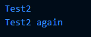
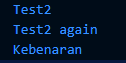
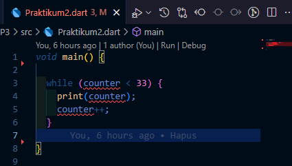
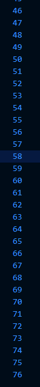
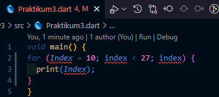
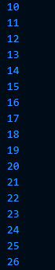
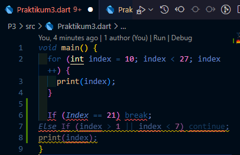
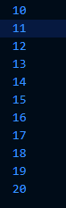
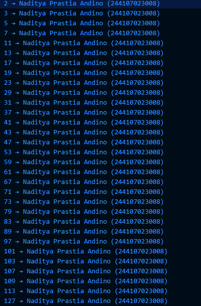
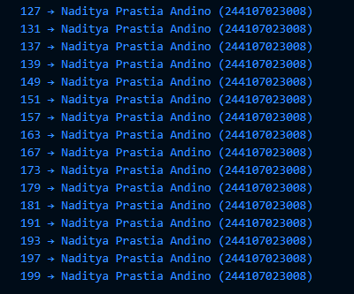

# 📘 Praktikum Pemrograman Mobile

**Nama**  : Naditya Prastia Andino
**NIM**   : 244107023008
**Kelas** : TI-3H  


## Praktikum 1

Langkah 1:
```dart
void main(){
    String test = "test2";
    if (test == "test1") {
      print("Test1");
    } else if (test == "test2") {
      print("Test2");
    } else {
      print("Something else");
    }
    if (test == "test2") print("Test2 again");
}
```

### Langkah 2

Silakan coba eksekusi (Run) kode pada langkah 1 tersebut. Apa yang terjadi? Jelaskan!



program menampilkan dua baris output karena ada dua blok if berbeda yang keduanya benar untuk nilai "test2"

### Langkah 3

Tambahkan kode program berikut, lalu coba eksekusi (Run) kode Anda.
```dart
String test = "true";
if (test) {
   print("Kebenaran");
}
```

Apa yang terjadi ? Jika terjadi error, silakan perbaiki namun tetap menggunakan if/else.

**Eksekusi kode:**
Error kembali muncul.
**Penjelasan:**

❌ Error terjadi di sini karena 2 hal:

Variabel dideklarasikan ulang
Anda sudah punya String test di awal, lalu mendeklarasikan lagi String test dalam scope yang sama. Dart tidak memperbolehkan redeklarasi variabel dengan nama sama di dalam satu blok main().

if butuh boolean, bukan string
Pada if (test), test bertipe String. Dart tidak otomatis menganggap string "true" sebagai nilai boolean true.

**Perbaikan Kode**

```dart
void main() {
  String test = "test2";

  if (test == "test1") {
    print("Test1");
  } else if (test == "test2") {
    print("Test2");
  } else {
    print("Something else");
  }

  if (test == "test2") {
    print("Test2 again");
  }

  bool isTrue = true;  // gunakan bool, bukan String
  if (isTrue) {
    print("Kebenaran");
  }
}
```




---

## Praktikum 2

### Langkah 1:

Ketik atau salin kode program berikut ke dalam fungsi main().

```dart
while (counter < 33) {
  print(counter);
  counter++;
}
```

### Langkah 2



**Penjelasan:**
Variabel `counter` belum pernah dideklarasikan sebelumnya. Dart butuh tahu apakah `counter` itu `int`, `double`, atau tipe data lainnya.

**Perbaikan:**
```dart
void main() {
  int counter = 0; // deklarasi dulu

  while (counter < 33) {
    print(counter);
    counter++;
  }

}
```

### Langkah 3

Tambahkan kode program berikut, lalu coba eksekusi (Run) kode Anda.

Apa yang terjadi ? Jika terjadi error, silakan perbaiki namun tetap menggunakan do-while.

**Penjelasan:**
`counter` tidak pernah dideklarasikan, sehingga Dart langsung menolak eksekusi.
**Perbaikan:** deklarasikan variabel `counter` terlebih dahulu, lalu tetap gunakan **`do-while`**.




## Praktikum 3

Langkah 1:

Menambahkan kode berikut pada main()
```dart
void main() {
  for (int index = 10; index < 27; index++) {
    print(index);
  }
}
```

### Langkah 2

Silakan coba eksekusi (Run) kode pada langkah 1 tersebut. Apa yang terjadi? Jelaskan! Lalu perbaiki jika terjadi error.

**Eksekusi kode:**



Error terjadi.
**Penjelasan:**

* Variabel `Index` dan `index` dianggap berbeda karena Dart **case-sensitive**.
* Dalam for-loop, `index` tidak bertambah karena tidak ada `index++`, hanya tertulis `index`.
* Akibatnya, loop tidak berjalan dengan benar.

**Perbaikan:**

```dart
void main() {
  for (int index = 10; index < 27; index++) {
    print(index);
  }
}
```



### Langkah 3

Tambahkan kode program berikut di dalam for-loop, lalu coba eksekusi (Run) kode Anda.

```dart
If (Index == 21) break;
Else If (index > 1 || index < 7) continue;
print(index);
```

Apa yang terjadi ? Jika terjadi error, silakan perbaiki namun tetap menggunakan for dan break-continue.



**Perbaikan:** gunakan variabel yang konsisten (`index` saja), tambahkan `index++`, lalu gunakan **`for`** dengan **`break`** atau **`continue`** sesuai kebutuhan.

```dart
void main() {
  for (int index = 10; index < 27; index++) {
    if (index == 21) break;                 // stop loop kalau index = 21
    else if (index > 1 && index < 7) continue; // skip kalau index di antara 2-6
    print(index);
  }
}
```



---

## 5. Tugas Praktikum

Buatlah sebuah program yang dapat menampilkan bilangan prima dari angka 0 sampai 201 menggunakan Dart. Ketika bilangan prima ditemukan, maka tampilkan nama lengkap dan NIM Anda.

```dart
void main() {
  String nama = "Naditya Prastia Andino";
  String nim = "244107023008";

  for (int i = 0; i <= 201; i++) {
    if (isPrima(i)) {
      print("$i → $nama ($nim)");
    }
  }
}

// Function Prima
bool isPrima(int n) {
  if (n < 2) return false; 
  for (int i = 2; i <= n ~/ 2; i++) {
    if (n % i == 0) return false;
  }
  return true;
}
```



