  # 📘 Praktikum Pemrograman Mobile 04
  
  **Nama**  : Naditya Prastia Andino
  **NIM**   : 244107023008
  **Kelas** : TI-3H.  


## Praktikum 1: Eksperimen Tipe Data List

Langkah 1:
```dart
void main() {
  var list = [1, 2, 3];
  assert(list.length == 3);
  assert(list[1] == 2);
  print(list.length);   
  print(list[1]);       
  
  list[1] = 1;
  assert(list[1] == 1);
  print(list[1]);      
}

```

### Langkah 2

Silakan coba eksekusi (Run) kode pada langkah 1 tersebut. Apa yang terjadi? Jelaskan!

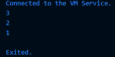

-List di Dart bisa diakses lewat indeks (list[index]).

-Kita bisa mengubah nilai elemen list dengan assignment.

-assert digunakan untuk memastikan kondisi benar saat runtime (jika salah → error).

### Langkah 3

Ubah kode pada langkah 1 menjadi variabel final yang mempunyai index = 5 dengan default value = null. Isilah nama dan NIM Anda pada elemen index ke-1 dan ke-2. Lalu print dan capture hasilnya. 

```dart
void main() {
  final List<dynamic> list = List.filled(5, null);

  list[1] = "Naditya P.A";  
  list[2] = "244107023008 ";

  print(list);
}
```
Apa yang terjadi ? Jika terjadi error, silakan perbaiki.


Tidak terjadi error, karena final hanya membuat variabel list tidak bisa diubah ke list lain, tapi isi elemennya masih boleh dimodifikasi.

List berhasil menampung data pada index ke-1 dan ke-2.

Default value null muncul pada elemen lain yang tidak diisi.


## Praktikum 2: Eksperimen Tipe Data Set

### Langkah 1:

Ketik atau salin kode program berikut ke dalam fungsi main().

```dart
var halogens = {'fluorine', 'chlorine', 'bromine', 'iodine', 'astatine'};
print(halogens);
```

### Langkah 2

Silakan coba eksekusi (Run) kode pada langkah 1 tersebut. Apa yang terjadi? Jelaskan! Lalu perbaiki jika terjadi error.

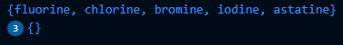

**Penjelasan:**
var halogens = { ... };
→ Ini adalah Set, yaitu kumpulan data unik di Dart (tidak bisa ada duplikasi).

Elemen di dalam kurung kurawal {} otomatis dianggap Set, kecuali ada tipe map (key: value).

print(halogens); akan menampilkan isi set.


### Langkah 3

Tambahkan kode program berikut, lalu coba eksekusi (Run) kode Anda.

```dart
var names1 = <String>{};
Set<String> names2 = {}; // This works, too.
var names3 = {}; // Creates a map, not a set.

print(names1);
print(names2);
print(names3);
```

Apa yang terjadi ? Jika terjadi error, silakan perbaiki namun tetap menggunakan ketiga variabel tersebut. Tambahkan elemen nama dan NIM Anda pada kedua variabel Set tersebut dengan dua fungsi berbeda yaitu .add() dan .addAll(). Untuk variabel Map dihapus, nanti kita coba di praktikum selanjutnya.

Dokumentasikan code dan hasil di console, lalu buat laporannya.

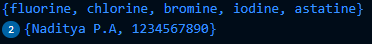

**Penjelasan:**
names1.add("...") → menambahkan satu per satu elemen ke Set.

names2.addAll({...}) → menambahkan beberapa elemen sekaligus.

Karena menggunakan Set, data tidak akan dobel meskipun ditambahkan dua kali.

Variabel names3 (Map) dihapus karena belum dibutuhkan di praktikum ini.


## Praktikum 3: Eksperimen Tipe Data Maps

### Langkah 1:

Ketik atau salin kode program berikut ke dalam fungsi main().
```dart
var gifts = {
  // Key:    Value
  'first': 'partridge',
  'second': 'turtledoves',
  'fifth': 1
};

var nobleGases = {
  2: 'helium',
  10: 'neon',
  18: 2,
};

print(gifts);
print(nobleGases);
```

### Langkah 2

Silakan coba eksekusi (Run) kode pada langkah 1 tersebut. Apa yang terjadi? Jelaskan! Lalu perbaiki jika terjadi error.

**Eksekusi kode:**

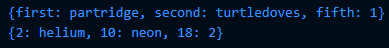

**Penjelasan:**

Map adalah struktur data key-value.

gifts → key bertipe String.

nobleGases → key bertipe int.

Value dalam Map bisa berbeda tipe (String dan int sekaligus) jika deklarasi pakai var.

### Langkah 3

Tambahkan kode program berikut, lalu coba eksekusi (Run) kode Anda.

```dart
var mhs1 = Map<String, String>();
gifts['first'] = 'partridge';
gifts['second'] = 'turtledoves';
gifts['fifth'] = 'golden rings';

var mhs2 = Map<int, String>();
nobleGases[2] = 'helium';
nobleGases[10] = 'neon';
nobleGases[18] = 'argon';
```

Apa yang terjadi ? Jika terjadi error, silakan perbaiki.

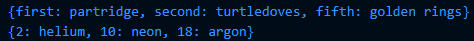

Tambahkan elemen nama dan NIM Anda pada tiap variabel di atas (gifts, nobleGases, mhs1, dan mhs2). Dokumentasikan hasilnya dan buat laporannya!

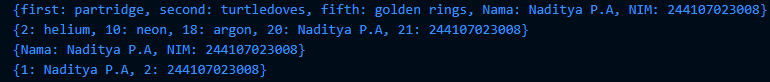

**Penjelasan:** tambahkan:

Nama: Naditya P.A

NIM: 244107023008

```dart
void main() {
  // Map dengan key String, value String
  var gifts = {
    'first': 'partridge',
    'second': 'turtledoves',
    'fifth': 'golden rings'
  };

  // Map dengan key int, value String
  var nobleGases = {
    2: 'helium',
    10: 'neon',
    18: 'argon'
  };

  // Deklarasi Map kosong, kemudian isi data
  var mhs1 = Map<String, String>();
  mhs1['Nama'] = 'Naditya P.A';
  mhs1['NIM'] = '244107023008';

  var mhs2 = Map<int, String>();
  mhs2[1] = 'Naditya P.A';
  mhs2[2] = '244107023008';

  // Tambahkan data Nama dan NIM ke gifts dan nobleGases juga
  gifts['Nama'] = 'Naditya P.A';
  gifts['NIM'] = '244107023008';

  nobleGases[20] = 'Naditya P.A';
  nobleGases[21] = '244107023008';

  // Cetak semua
  print(gifts);
  print(nobleGases);
  print(mhs1);
  print(mhs2);
}
```


## Praktikum 4: Eksperimen Tipe Data List: Spread dan Control-flow Operators

### Langkah 1:

Ketik atau salin kode program berikut ke dalam fungsi main().

```dart 
var list = [1, 2, 3];
var list2 = [0, ...list];
print(list1);
print(list2);
print(list2.length);
```


### Langkah 2:

Silakan coba eksekusi (Run) kode pada langkah 1 tersebut. Apa yang terjadi? Jelaskan! Lalu perbaiki jika terjadi error.

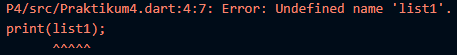

Error karena memanggil print(list1); padahal variabel list1 tidak pernah dibuat.
Variabel yang ada hanyalah list dan list2.

**Perbaikan:**

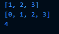

```dart 
void main() {
  var list = [1, 2, 3];

  // Membuat list2 dengan elemen 0 + elemen dari list
  var list2 = [0, ...list];

  // Cetak list awal
  print(list);

  // Cetak list2 hasil spread operator
  print(list2);

  // Panjang list2
  print(list2.length);
}
```

#### Langkah 3:

Tambahkan kode program berikut, lalu coba eksekusi (Run) kode Anda.

```dart
list1 = [1, 2, null];
print(list1);
var list3 = [0, ...?list1];
print(list3.length);
```

Apa yang terjadi ? Jika terjadi error, silakan perbaiki.

Tambahkan variabel list berisi NIM Anda menggunakan Spread Operators. Dokumentasikan hasilnya dan buat laporannya!

**Penjelasan**

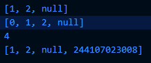

Kode yang dipakai 

```dart
void main() {
  // List dengan nilai null di dalamnya
  var list1 = [1, 2, null];
  print(list1);

  // Spread operator dengan null-aware (?),
  // agar kalau list1 null tidak error
  var list3 = [0, ...?list1];
  print(list3);
  print(list3.length);

  // Tambahkan variabel list berisi NIM menggunakan spread operator
  var nim = ['244107023008']; // contoh NIM
  var listNIM = [...list1, ...nim];
  print(listNIM);
}
```

list1 = [1, 2, null];
→ Membuat list dengan salah satu elemen bernilai null.

...?list1
→ Null-aware spread operator.
Jika list1 adalah null, maka isi list tidak akan ditambahkan (tidak error).

list3 = [0, ...?list1];
→ Hasilnya [0, 1, 2, null] dengan panjang 4.

listNIM = [...list1, ...nim];
→ Menggabungkan list1 dengan nim.
Hasil: [1, 2, null, 1234567890].

### Langkah 4:

Tambahkan kode program berikut, lalu coba eksekusi (Run) kode Anda.

```dart
var nav = ['Home', 'Furniture', 'Plants', if (promoActive) 'Outlet'];
print(nav);
```

Apa yang terjadi ? Jika terjadi error, silakan perbaiki. Tunjukkan hasilnya jika variabel promoActive ketika true dan false.

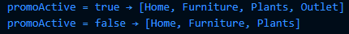

**Penjelasan**

Collection if di Dart → memungkinkan memasukkan elemen ke dalam list hanya jika suatu kondisi bernilai true.

Jika promoActive = true, maka 'Outlet' ikut masuk ke list.

Jika promoActive = false, 'Outlet' tidak dimasukkan.

Collection if sangat berguna untuk membuat list dinamis berdasarkan kondisi.

Tidak ada error setelah promoActive dideklarasikan sebagai bool.

### Langkah 5:

Tambahkan kode program berikut, lalu coba eksekusi (Run) kode Anda.

```dart
var nav2 = ['Home', 'Furniture', 'Plants', if (login case 'Manager') 'Inventory'];
print(nav2);
```

Apa yang terjadi ? Jika terjadi error, silakan perbaiki. Tunjukkan hasilnya jika variabel login mempunyai kondisi lain.

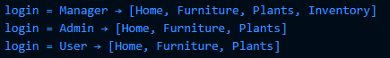

```dart
void main() {
  // Kasus 1: login sebagai Manager
  var login = 'Manager';
  var nav2 = ['Home', 'Furniture', 'Plants', if (login == 'Manager') 'Inventory'];
  print("login = Manager → $nav2");

  // Kasus 2: login sebagai Admin
  login = 'Admin';
  nav2 = ['Home', 'Furniture', 'Plants', if (login == 'Manager') 'Inventory'];
  print("login = Admin → $nav2");

  // Kasus 3: login sebagai User biasa
  login = 'User';
  nav2 = ['Home', 'Furniture', 'Plants', if (login == 'Manager') 'Inventory'];
  print("login = User → $nav2");
}
```
**Penjelasan**

if (login == 'Manager') 'Inventory' → hanya menambahkan 'Inventory' ke dalam list jika login bernilai "Manager".

Jika login adalah "Admin" atau "User", maka 'Inventory' tidak ikut dimasukkan.

Collection if dapat dipadukan dengan kondisi login untuk membuat menu navigasi dinamis.

Tidak ada error setelah sintaks diperbaiki (== bukan case).


### Langkah 6:

Tambahkan kode program berikut, lalu coba eksekusi (Run) kode Anda.


```dart
var listOfInts = [1, 2, 3];
var listOfStrings = ['#0', for (var i in listOfInts) '#$i'];
assert(listOfStrings[1] == '#1');
print(listOfStrings);
```

Apa yang terjadi ? Jika terjadi error, silakan perbaiki. Jelaskan manfaat Collection For dan dokumentasikan hasilnya.

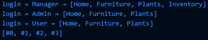

**Penjelasan**

```dart
void main() {
  // Kasus 1: login sebagai Manager
  var login = 'Manager';
  var nav2 = ['Home', 'Furniture', 'Plants', if (login == 'Manager') 'Inventory'];
  print("login = Manager → $nav2");

  // Kasus 2: login sebagai Admin
  login = 'Admin';
  nav2 = ['Home', 'Furniture', 'Plants', if (login == 'Manager') 'Inventory'];
  print("login = Admin → $nav2");

  // Kasus 3: login sebagai User biasa
  login = 'User';
  nav2 = ['Home', 'Furniture', 'Plants', if (login == 'Manager') 'Inventory'];
  print("login = User → $nav2");
  var listOfInts = [1, 2, 3];
  var listOfStrings = ['#0', for (var i in listOfInts) '#$i'];
  assert(listOfStrings[1] == '#1');
  
print(listOfStrings);

}
```

listOfInts = [1, 2, 3] → list integer.

listOfStrings = ['#0', for (var i in listOfInts) '#$i'];

Awalnya ada elemen '#0'.

Lalu, dengan collection for, setiap elemen i di listOfInts ditambahkan ke list dengan format string '#$i'.

Jadi hasilnya: ['#0', '#1', '#2', '#3'].

assert(listOfStrings[1] == '#1'); → benar, karena elemen indeks ke-1 adalah '#1'.

print(listOfStrings); → menampilkan seluruh isi list.

## Praktikum 5: Eksperimen Tipe Data Records


### Langkah 1:

Ketik atau salin kode program berikut ke dalam fungsi main().

```dart
var record = ('first', a: 2, b: true, 'last');
print(record)
```

### Langkah 2:

Silakan coba eksekusi (Run) kode pada langkah 1 tersebut. Apa yang terjadi? Jelaskan! Lalu perbaiki jika terjadi error.

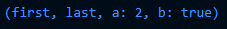

```dart
void main() {
  var record = ('first', a: 2, b: true, 'last');
  print(record);
}
```

**Penjelasan**

Record adalah tipe data baru di Dart 3, mirip dengan tuple di bahasa lain.

Record bisa menyimpan beberapa nilai berbeda dalam satu variabel tanpa harus membuat class.

Elemen record bisa diakses dengan positional field ($1, $2, dst.) atau named field (a, b, dst.).


### Langkah 3:

Tambahkan kode program berikut di luar scope void main(), lalu coba eksekusi (Run) kode Anda.

```dart
(int, int) tukar((int, int) record) {
  var (a, b) = record;
  return (b, a);
}
```

Apa yang terjadi ? Jika terjadi error, silakan perbaiki. Gunakan fungsi tukar() di dalam main() sehingga tampak jelas proses pertukaran value field di dalam Records.

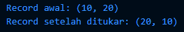


```dart
// Fungsi tukar: menerima record (int, int) lalu menukar isinya
(int, int) tukar((int, int) record) {
  var (a, b) = record;   // destructuring record jadi variabel a dan b
  return (b, a);         // mengembalikan record dengan posisi ditukar
}

void main() {
  var record = (10, 20);
  print("Record awal: $record");

  var hasilTukar = tukar(record);
  print("Record setelah ditukar: $hasilTukar");
}
```

**Penjelasan**

(int, int) tukar(...) mendeklarasikan fungsi yang menerima dan mengembalikan record dengan dua int.

var (a, b) = record; adalah destructuring record → memecah record (10, 20) menjadi a=10, b=20.

return (b, a); menukar urutan nilainya.

Di main(), kita bisa lihat perbedaan hasil sebelum dan sesudah pertukaran.

### Langkah 4:

Tambahkan kode program berikut di dalam scope void main(), lalu coba eksekusi (Run) kode Anda.

```dart
// Record type annotation in a variable declaration:
(String, int) mahasiswa;
print(mahasiswa);
```

Apa yang terjadi ? Jika terjadi error, silakan perbaiki. Inisialisasi field nama dan NIM Anda pada variabel record mahasiswa di atas. Dokumentasikan hasilnya dan buat laporannya!

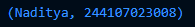

**Penjelasan**

(String, int) mahasiswa; → mendeklarasikan record dengan field posisional: String dan int.

Karena record tidak nullable, harus diinisialisasi, misalnya:
```dart
(String, int) mahasiswa = ("Nama", NIM);
```
print(mahasiswa); akan menampilkan isi record secara otomatis.


### Langkah 5:

Tambahkan kode program berikut di dalam scope void main(), lalu coba eksekusi (Run) kode Anda.

```dart

var mahasiswa2 = ('first', a: 2, b: true, 'last');

print(mahasiswa2.$1); // Prints 'first'
print(mahasiswa2.a); // Prints 2
print(mahasiswa2.b); // Prints true
print(mahasiswa2.$2); // Prints 'last'
```

Apa yang terjadi ? Jika terjadi error, silakan perbaiki. Gantilah salah satu isi record dengan nama dan NIM Anda, lalu dokumentasikan hasilnya dan buat laporannya!

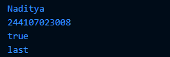

**Penjelasan**

```dart
void main() {
  var mahasiswa2 = ('Naditya', a: 244107023008, b: true, 'last');

  print(mahasiswa2.$1); // Prints 'Naditya'
  print(mahasiswa2.a);  // Prints 244107023008
  print(mahasiswa2.b);  // Prints true
  print(mahasiswa2.$2); // Prints 'last'
}
```

Record mahasiswa2 berisi campuran positional dan named fields.

Akses:

.$1 → ambil field pertama (positional) = Naditya

.a → ambil field bernama a = 244107023008

.b → ambil field bernama b = true

.$2 → ambil field positional kedua = 'last'

## Tugas Praktikum 

#### 1. Silakan selesaikan Praktikum 1 sampai 5, lalu dokumentasikan berupa screenshot hasil pekerjaan Anda beserta penjelasannya!


#### 2. Jelaskan yang dimaksud Functions dalam bahasa Dart!

Jawab :

Fungsi (function) adalah blok kode yang bisa dipanggil untuk menjalankan suatu tugas tertentu.
Fungsi membantu mengorganisir program agar modular, reusable, dan mudah dipelihara.


#### 3. Jelaskan jenis-jenis parameter di Functions beserta contoh sintaksnya!

Jawab :

a. Positional Parameter

Urutannya penting.

```dart
void cetakNama(String nama, int umur) {
  print("Nama: $nama, Umur: $umur");
}

void main() {
  cetakNama("Naditya", 21);
}
```

b. Optional Positional Parameter

Ditandai dengan []. Bisa tidak diisi, default null.

```dart
void cetakData(String nama, [int? umur]) {
  print("Nama: $nama, Umur: $umur");
}

void main() {
  cetakData("Naditya");
  cetakData("Naditya", 21);
}
```

c. Named Parameter

Ditandai dengan {}. Dipanggil dengan nama parameternya.

```dart
void cetakBiodata({required String nama, int umur = 0}) {
  print("Nama: $nama, Umur: $umur");
}

void main() {
  cetakBiodata(nama: "Naditya", umur: 21);
}
```

Functions sebagai First-Class Objects

Fungsi di Dart diperlakukan seperti nilai/data, sehingga bisa:

disimpan dalam variabel

dikirim sebagai argumen

dikembalikan dari fungsi lain

```dart
int kali(int a, int b) => a * b;

void jalankanFungsi(Function f) {
  print("Hasil fungsi: ${f(3, 4)}");
}

void main() {
  var fungsi = kali;
  print(fungsi(2, 5));   // fungsi disimpan dalam variabel
  jalankanFungsi(kali);  // fungsi dikirim sebagai argumen
}
```

#### 4. Jelaskan maksud Functions sebagai first-class objects beserta contoh sintaknya!

Jawab :

Fungsi di Dart diperlakukan seperti nilai/data, sehingga bisa:

disimpan dalam variabel

dikirim sebagai argumen

dikembalikan dari fungsi lain

Contoh:

```dart
int kali(int a, int b) => a * b;

void jalankanFungsi(Function f) {
  print("Hasil fungsi: ${f(3, 4)}");
}

void main() {
  var fungsi = kali;
  print(fungsi(2, 5));   // fungsi disimpan dalam variabel
  jalankanFungsi(kali);  // fungsi dikirim sebagai argumen
}
```

#### 5. Apa itu Anonymous Functions? Jelaskan dan berikan contohnya!

Jawab :

Fungsi tanpa nama (kadang disebut lambda atau closure singkat). Biasanya dipakai sekali saja.

Contoh:

```dart
void main() {
  var daftar = [1, 2, 3];

  // anonymous function di dalam forEach
  daftar.forEach((item) {
    print("Nilai: $item");
  });

  // bentuk lebih ringkas (arrow function)
  daftar.forEach((item) => print("Nilai cepat: $item"));
}
```

#### 6. Jelaskan perbedaan Lexical scope dan Lexical closures! Berikan contohnya!

Jawab :


Contoh:
```dart
void main() {
  var daftar = [1, 2, 3];

  // anonymous function di dalam forEach
  daftar.forEach((item) {
    print("Nilai: $item");
  });

  // bentuk lebih ringkas (arrow function)
  daftar.forEach((item) => print("Nilai cepat: $item"));
}
```

Lexical Scope vs Lexical Closures
a. Lexical Scope

Scope ditentukan oleh letak penulisan kode, bukan saat runtime. Variabel hanya bisa diakses dalam scope tempat dia didefinisikan.

Contoh:

```dart
void main() {
  var luar = "Saya di luar fungsi";

  void dalam() {
    print(luar); // bisa akses karena lexical scope
  }

  dalam();
}
```

Lexical Closures

Closure adalah fungsi yang “membawa” variabel dari scope luar meskipun scope luar sudah selesai.

Contoh:

```dart
Function hitungKelipatan(int faktor) {
  return (int angka) => angka * faktor; // closure simpan variabel faktor
}

void main() {
  var kali2 = hitungKelipatan(2);
  var kali3 = hitungKelipatan(3);

  print(kali2(5)); // 10
  print(kali3(5)); // 15
}
```


#### 7. Jelaskan dengan contoh cara membuat return multiple value di Functions!

Jawab :

Return Multiple Value di Functions

Dart tidak bisa langsung return lebih dari satu nilai, tapi kita bisa pakai:

List

Map

Record (fitur Dart 3)

Contoh pakai Record (cara modern):

```dart
(String, int) getMahasiswa() {
  return ("Naditya", 244107023008);
}

void main() {
  var (nama, nim) = getMahasiswa();
  print("Nama: $nama, NIM: $nim");
}

```
