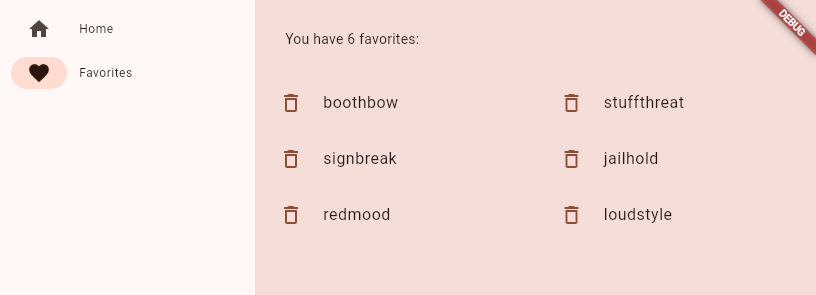

  # 📘 Praktikum Pemrograman Mobile 05 Codelabs: Your first Flutter app,
  
  **Nama**  : Naditya Prastia Andino
  **NIM**   : 244107023008
  **Kelas** : TI-3H.  


# Praktikum 1: Membuat Project Flutter Baru

## Langkah-Langkah Praktikum

### 1. Membuat Project Flutter Baru

* Buka **Visual Studio Code**.
* Tekan tombol `F1` atau `Ctrl + Shift + P` (Windows/Linux) atau `Shift + Cmd + P` (Mac).
* Pada **Command Palette**, ketik **flutter new**.
* Pilih **Flutter: New Project**.
* Pilih jenis project: **Application**.
* Tentukan lokasi folder penyimpanan, misalnya di `C:\src\`.
* Beri nama project, contoh: **namer\_app**.

📌 **Catatan:**
Nama project harus **huruf kecil semua (lowercase)**, tanpa spasi. Jika perlu pemisah kata gunakan **underscore** (`_`).


---

### 2. Konfirmasi Trust Folder

* Setelah project dibuat, VS Code akan membuka folder project.
* Muncul jendela konfirmasi **“Do you trust the authors of the files in this folder?”**.
* Pilih **Yes** agar semua fitur Flutter di VS Code aktif.

---

### 3. Konfigurasi File `pubspec.yaml`

Buka file `pubspec.yaml` lalu ganti seluruh isinya dengan kode berikut:

```yaml
name: namer_app
description: "A new Flutter project."
publish_to: "none"
version: 0.1.0

environment:
  sdk: ^3.9.0

dependencies:
  flutter:
    sdk: flutter
  english_words: ^4.0.0
  provider: ^6.1.5

dev_dependencies:
  flutter_test:
    sdk: flutter
  flutter_lints: ^6.0.0

flutter:
  uses-material-design: true
```

Fungsi:

* Menyimpan metadata aplikasi (nama, versi).
* Menentukan **dependencies** (package/library) yang digunakan.


---

### 4. Konfigurasi File `analysis_options.yaml`

Buka file `analysis_options.yaml`, lalu ganti isinya dengan:

```yaml
include: package:flutter_lints/flutter.yaml

linter:
  rules:
    avoid_print: false
    prefer_const_constructors_in_immutables: false
    prefer_const_constructors: false
    prefer_const_literals_to_create_immutables: false
    prefer_final_fields: false
    unnecessary_breaks: true
    use_key_in_widget_constructors: false
```

Fungsi:
Mengatur aturan analisis kode (linter). Pada tahap awal dibuat **longgar** agar lebih mudah belajar.

---

### 5. Mengisi File `main.dart`

Buka file `lib/main.dart`, lalu ganti seluruh isinya dengan kode berikut:

```dart
import 'package:english_words/english_words.dart';
import 'package:flutter/material.dart';
import 'package:provider/provider.dart';

void main() {
  runApp(MyApp());
}

class MyApp extends StatelessWidget {
  const MyApp({super.key});

  @override
  Widget build(BuildContext context) {
    return ChangeNotifierProvider(
      create: (context) => MyAppState(),
      child: MaterialApp(
        title: 'Namer App',
        theme: ThemeData(
          colorScheme: ColorScheme.fromSeed(seedColor: Colors.deepOrange),
        ),
        home: MyHomePage(),
      ),
    );
  }
}

class MyAppState extends ChangeNotifier {
  var current = WordPair.random();
}

class MyHomePage extends StatelessWidget {
  @override
  Widget build(BuildContext context) {
    var appState = context.watch<MyAppState>();

    return Scaffold(
      body: Column(
        children: [
          Text('A random idea:'),
          Text(appState.current.asLowerCase),
        ],
      ),
    );
  }
}
```

Fungsi kode:

* `MyAppState`: menyimpan state aplikasi (random word pair).
* `MyApp`: widget utama dengan **Provider** untuk state management.
* `MyHomePage`: menampilkan text ide random dari package **english\_words**.

## Langkah 4: Add a Button

### 1. Menjalankan Aplikasi

* Buka file `lib/main.dart`.
* Pastikan **target device** sudah dipilih di pojok kanan bawah VS Code.
* Klik tombol **▶ (Run/Debug)** di pojok kanan atas VS Code.
* Tunggu hingga aplikasi berjalan (±1 menit).

📱 Tampilan awal aplikasi:

> Teks *“A random idea”* akan muncul di layar.

---

### 2. Hot Reload Pertama

Untuk mencoba **Hot Reload**:

* Ubah teks di widget pertama `Text()` seperti berikut:

```dart
return Scaffold(
  body: Column(
    children: [
      Text('A random AWESOME idea:'),  // ← Perubahan teks
      Text(appState.current.asLowerCase),
    ],
  ),
);

```


* Tekan **Ctrl+S** (atau Cmd+S).
* Perhatikan: tampilan aplikasi langsung berubah, tetapi kata random **tidak berubah**.

🔑 Inilah konsep **Hot Reload** pada Flutter.

---

### 3. Menambahkan Tombol

Tambahkan sebuah tombol di bawah `Text` kedua.

```dart
return Scaffold(
  body: Column(
    children: [
      Text('A random AWESOME idea:'),
      Text(appState.current.asLowerCase),

      // Tambahan button
      ElevatedButton(
        onPressed: () {
          print('button pressed!');
        },
        child: Text('Next'),
      ),
    ],
  ),
);
```

* Simpan file.
* Aplikasi akan menampilkan tombol **Next**.
* Saat ditekan, console akan menampilkan pesan:

```
button pressed!
```

---

### 4. Menambahkan Fungsi `getNext()`

Supaya tombol menghasilkan kata baru, tambahkan fungsi pada **MyAppState**.

```dart
class MyAppState extends ChangeNotifier {
  var current = WordPair.random();

  // Tambahan method
  void getNext() {
    current = WordPair.random();
    notifyListeners();
  }
}
```

---

### 5. Memanggil Fungsi dari Tombol

Modifikasi bagian `ElevatedButton` agar memanggil fungsi `getNext()`.

```dart
ElevatedButton(
  onPressed: () {
    appState.getNext();   // ganti print()
  },
  child: Text('Next'),
),
```

---


## Langkah 5: Make the App Prettier

### 1. Kondisi Awal Aplikasi

Saat ini tampilan aplikasi masih sederhana:

* Teks random kecil
* Posisi konten masih menempel di atas
* Warna dominan hitam-putih

Target: membuat tampilan lebih menarik dengan **Card**, **warna tema**, dan **UI terpusat**.

---

### 2. Menyederhanakan Akses `pair`

Refactor `MyHomePage` agar hanya mengambil nilai kata random, bukan keseluruhan `appState`.

```dart
class MyHomePage extends StatelessWidget {
  @override
  Widget build(BuildContext context) {
    var appState = context.watch<MyAppState>();
    var pair = appState.current;   // ← ambil langsung pair

    return Scaffold(
      body: Column(
        children: [
          Text('A random AWESOME idea:'),
          Text(pair.asLowerCase),  // ← gunakan pair langsung
          ElevatedButton(
            onPressed: () {
              appState.getNext();
            },
            child: Text('Next'),
          ),
        ],
      ),
    );
  }
}
```

---

### 3. Extract Widget → `BigCard`

Gunakan fitur **Extract Widget** di VS Code untuk membuat widget baru:

```dart
class BigCard extends StatelessWidget {
  const BigCard({super.key, required this.pair});

  final WordPair pair;

  @override
  Widget build(BuildContext context) {
    return Text(pair.asLowerCase);
  }
}
```

---

### 4. Tambahkan Padding & Card

Agar lebih rapi, bungkus `Text` dengan **Padding** dan **Card**.

```dart
class BigCard extends StatelessWidget {
  const BigCard({super.key, required this.pair});

  final WordPair pair;

  @override
  Widget build(BuildContext context) {
    return Card(
      child: Padding(
        padding: const EdgeInsets.all(20),
        child: Text(pair.asLowerCase),
      ),
    );
  }
}
```

---

### 5. Tambahkan Warna Tema

Gunakan warna dari **Theme** agar konsisten di seluruh aplikasi.

```dart
@override
Widget build(BuildContext context) {
  final theme = Theme.of(context);

  return Card(
    color: theme.colorScheme.primary,   // warna utama app
    child: Padding(
      padding: const EdgeInsets.all(20),
      child: Text(pair.asLowerCase),
    ),
  );
}
```


---

### 6. Styling Teks dengan `TextTheme`

Perbesar ukuran teks dan ubah warna agar kontras dengan background.

```dart
@override
Widget build(BuildContext context) {
  final theme = Theme.of(context);
  final style = theme.textTheme.displayMedium!.copyWith(
    color: theme.colorScheme.onPrimary,
  );

  return Card(
    color: theme.colorScheme.primary,
    child: Padding(
      padding: const EdgeInsets.all(20),
      child: Text(pair.asLowerCase, style: style),
    ),
  );
}
```


---

### 7. Aksesibilitas

Tambahkan `semanticsLabel` agar **screen reader** membaca kata dengan benar.

```dart
child: Text(
  pair.asLowerCase,
  style: style,
  semanticsLabel: "${pair.first} ${pair.second}",
),
```

---

### 8. Centering UI

Agar konten tidak menempel di atas, ubah `MyHomePage` menjadi:

```dart
class MyHomePage extends StatelessWidget {
  @override
  Widget build(BuildContext context) {
    var appState = context.watch<MyAppState>();
    var pair = appState.current;

    return Scaffold(
      body: Center(
        child: Column(
          mainAxisAlignment: MainAxisAlignment.center,
          children: [
            BigCard(pair: pair),
            SizedBox(height: 10),   // jarak antar widget
            ElevatedButton(
              onPressed: () {
                appState.getNext();
              },
              child: Text('Next'),
            ),
          ],
        ),
      ),
    );
  }
}
```


Oke 👍 saya akan rangkum **Langkah 6: Add Functionality** dari codelab Flutter ke dalam bentuk **laporan praktikum Markdown**, supaya rapi seperti sebelumnya.

---
## Langkah 6: Add Functionality

### 1. Permasalahan

Aplikasi sudah bisa menampilkan kata acak, tetapi setiap kali pengguna menekan **Next**, kata sebelumnya hilang selamanya.
➡️ Solusi: tambahkan **fitur Like** agar kata yang disukai bisa disimpan di daftar favorit.

---

### 2. Menambahkan Business Logic

#### Kode di `MyAppState`

Tambahkan properti **favorites** dan method **toggleFavorite()**.

```dart
class MyAppState extends ChangeNotifier {
  var current = WordPair.random();

  void getNext() {
    current = WordPair.random();
    notifyListeners();
  }

  // ↓ Tambahan baru
  var favorites = <WordPair>[];   // list untuk menyimpan kata favorit

  void toggleFavorite() {
    if (favorites.contains(current)) {
      favorites.remove(current);   // hapus jika sudah ada
    } else {
      favorites.add(current);      // tambahkan jika belum ada
    }
    notifyListeners();             // update UI
  }
}
```

📌 **Penjelasan**:

* `favorites` menyimpan daftar kata yang disukai.
* `toggleFavorite()` akan menambahkan kata ke favorit jika belum ada, atau menghapusnya jika sudah ada.
* `notifyListeners()` memastikan UI ikut berubah.

---

### 3. Menambahkan Tombol Like

#### Ubah `MyHomePage` → tambahkan Row untuk tombol

Awalnya hanya ada tombol **Next**, sekarang kita tambahkan tombol **Like** di sampingnya.

```dart
class MyHomePage extends StatelessWidget {
  @override
  Widget build(BuildContext context) {
    var appState = context.watch<MyAppState>();
    var pair = appState.current;

    // Tentukan ikon sesuai status favorit
    IconData icon;
    if (appState.favorites.contains(pair)) {
      icon = Icons.favorite;          // jika sudah difavoritkan → hati penuh
    } else {
      icon = Icons.favorite_border;   // jika belum → hati kosong
    }

    return Scaffold(
      body: Center(
        child: Column(
          mainAxisAlignment: MainAxisAlignment.center,
          children: [
            BigCard(pair: pair),
            SizedBox(height: 10),
            Row(
              mainAxisSize: MainAxisSize.min,
              children: [
                ElevatedButton.icon(
                  onPressed: () {
                    appState.toggleFavorite();
                  },
                  icon: Icon(icon),
                  label: Text('Like'),
                ),
                SizedBox(width: 10),
                ElevatedButton(
                  onPressed: () {
                    appState.getNext();
                  },
                  child: Text('Next'),
                ),
              ],
            ),
          ],
        ),
      ),
    );
  }
}
```

---

### 4. Hasil Tampilan


Mantap 👍 sekarang saya rangkum **Langkah 7: Add Navigation Rail** ke dalam bentuk laporan praktikum dengan format Markdown agar rapi.

---

## Langkah 7: Add Navigation Rail

### 1. Permasalahan

Saat ini aplikasi hanya memiliki **satu layar** (GeneratorPage).
➡️ Tujuan: menambahkan **navigasi** agar bisa berpindah antar layar (Home & Favorites).

---

### 2. Memecah MyHomePage

Semua isi lama `MyHomePage` dipindahkan ke widget baru **GeneratorPage**, lalu `MyHomePage` hanya menjadi wadah dengan **NavigationRail**.

```dart
class MyHomePage extends StatelessWidget {
  @override
  Widget build(BuildContext context) {
    return Scaffold(
      body: Row(
        children: [
          SafeArea(
            child: NavigationRail(
              extended: false,
              destinations: [
                NavigationRailDestination(
                  icon: Icon(Icons.home),
                  label: Text('Home'),
                ),
                NavigationRailDestination(
                  icon: Icon(Icons.favorite),
                  label: Text('Favorites'),
                ),
              ],
              selectedIndex: 0,
              onDestinationSelected: (value) {
                print('selected: $value');
              },
            ),
          ),
          Expanded(
            child: Container(
              color: Theme.of(context).colorScheme.primaryContainer,
              child: GeneratorPage(),
            ),
          ),
        ],
      ),
    );
  }
}
```


---

### 3. Membuat GeneratorPage

Isi lama `MyHomePage` dipindahkan ke sini:

```dart
class GeneratorPage extends StatelessWidget {
  @override
  Widget build(BuildContext context) {
    var appState = context.watch<MyAppState>();
    var pair = appState.current;

    IconData icon =
        appState.favorites.contains(pair) ? Icons.favorite : Icons.favorite_border;

    return Center(
      child: Column(
        mainAxisAlignment: MainAxisAlignment.center,
        children: [
          BigCard(pair: pair),
          SizedBox(height: 10),
          Row(
            mainAxisSize: MainAxisSize.min,
            children: [
              ElevatedButton.icon(
                onPressed: () {
                  appState.toggleFavorite();
                },
                icon: Icon(icon),
                label: Text('Like'),
              ),
              SizedBox(width: 10),
              ElevatedButton(
                onPressed: () {
                  appState.getNext();
                },
                child: Text('Next'),
              ),
            ],
          ),
        ],
      ),
    );
  }
}
```


---

### 4. Mengubah MyHomePage menjadi StatefulWidget

Agar bisa menyimpan `selectedIndex`, ubah MyHomePage → StatefulWidget.

```dart
class MyHomePage extends StatefulWidget {
  @override
  State<MyHomePage> createState() => _MyHomePageState();
}

class _MyHomePageState extends State<MyHomePage> {
  var selectedIndex = 0;

  @override
  Widget build(BuildContext context) {
    Widget page;
    switch (selectedIndex) {
      case 0:
        page = GeneratorPage();
        break;
      case 1:
        page = Placeholder(); // sementara untuk Favorites
        break;
      default:
        throw UnimplementedError('no widget for $selectedIndex');
    }

    return Scaffold(
      body: Row(
        children: [
          SafeArea(
            child: NavigationRail(
              extended: false,
              destinations: [
                NavigationRailDestination(
                  icon: Icon(Icons.home),
                  label: Text('Home'),
                ),
                NavigationRailDestination(
                  icon: Icon(Icons.favorite),
                  label: Text('Favorites'),
                ),
              ],
              selectedIndex: selectedIndex,
              onDestinationSelected: (value) {
                setState(() {
                  selectedIndex = value;
                });
              },
            ),
          ),
          Expanded(
            child: Container(
              color: Theme.of(context).colorScheme.primaryContainer,
              child: page,
            ),
          ),
        ],
      ),
    );
  }
}
```


📌 Sekarang NavigationRail sudah bisa berpindah antar menu.

---

### 5. Membuat Navigation Rail Responsif

Gunakan `LayoutBuilder` untuk menampilkan label otomatis jika lebar layar ≥ 600px.

```dart
return LayoutBuilder(builder: (context, constraints) {
  return Scaffold(
    body: Row(
      children: [
        SafeArea(
          child: NavigationRail(
            extended: constraints.maxWidth >= 600, // responsif
            destinations: [
              NavigationRailDestination(
                icon: Icon(Icons.home),
                label: Text('Home'),
              ),
              NavigationRailDestination(
                icon: Icon(Icons.favorite),
                label: Text('Favorites'),
              ),
            ],
            selectedIndex: selectedIndex,
            onDestinationSelected: (value) {
              setState(() {
                selectedIndex = value;
              });
            },
          ),
        ),
        Expanded(
          child: Container(
            color: Theme.of(context).colorScheme.primaryContainer,
            child: page,
          ),
        ),
      ],
    ),
  );
});
```

---

### 6. Hasil Tampilan

📱 Sekarang aplikasi memiliki:

* **NavigationRail** di sisi kiri (ikon Home & Favorites).
* Bagian kanan menampilkan halaman sesuai menu.
* Jika lebar layar ≥ 600px → label tombol otomatis muncul.

---


## Langkah 8: Add a New Page (Favorites Page)

### 1. Permasalahan

Pada langkah sebelumnya, menu **Favorites** di `NavigationRail` masih menggunakan `Placeholder`.
➡️ Tujuan: membuat halaman **FavoritesPage** untuk menampilkan daftar kata favorit yang sudah disimpan.

---

### 2. Membuat FavoritesPage

Tambahkan widget baru `FavoritesPage` pada **lib/main.dart**.

```dart
class FavoritesPage extends StatelessWidget {
  @override
  Widget build(BuildContext context) {
    var appState = context.watch<MyAppState>();

    if (appState.favorites.isEmpty) {
      return Center(
        child: Text('No favorites yet.'),
      );
    }

    return ListView(
      children: [
        Padding(
          padding: const EdgeInsets.all(20),
          child: Text('You have ${appState.favorites.length} favorites:'),
        ),
        for (var pair in appState.favorites)
          ListTile(
            leading: Icon(Icons.favorite),
            title: Text(pair.asLowerCase),
          ),
      ],
    );
  }
}
```

---

### 3. Penjelasan Kode

* `context.watch<MyAppState>()` → mengambil data favorit dari state aplikasi.
* Jika daftar `favorites` kosong → tampil pesan *"No favorites yet."*.
* Jika ada isi → gunakan **ListView** agar daftar bisa discroll.
* Bagian atas menampilkan jumlah favorit.
* Sisanya, tiap kata favorit ditampilkan dengan **ListTile** (ikon + teks).

---

### 4. Mengganti Placeholder dengan FavoritesPage

Pada class `_MyHomePageState`, ubah bagian `switch` dari:

```dart
case 1:
  page = Placeholder();
  break;
```

menjadi:

```dart
case 1:
  page = FavoritesPage();
  break;
```

---

### 5. Hasil Tampilan

📱 Sekarang aplikasi memiliki:

* Halaman **Home (GeneratorPage)** → untuk generate kata random.
* Halaman **FavoritesPage** → menampilkan daftar kata favorit.
* Jika belum ada favorit → muncul teks *"No favorites yet."*.
* Jika ada favorit → muncul daftar kata dengan ikon hati.

---



