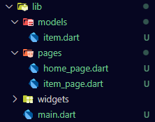
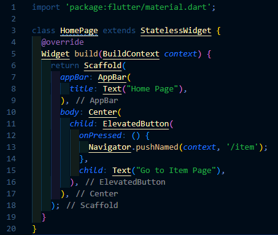
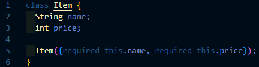
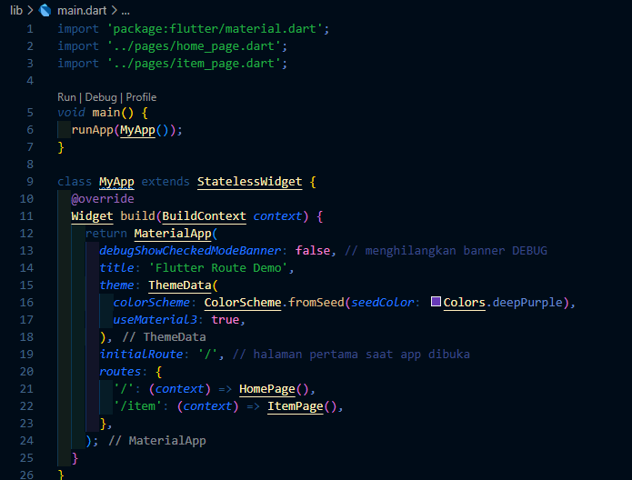
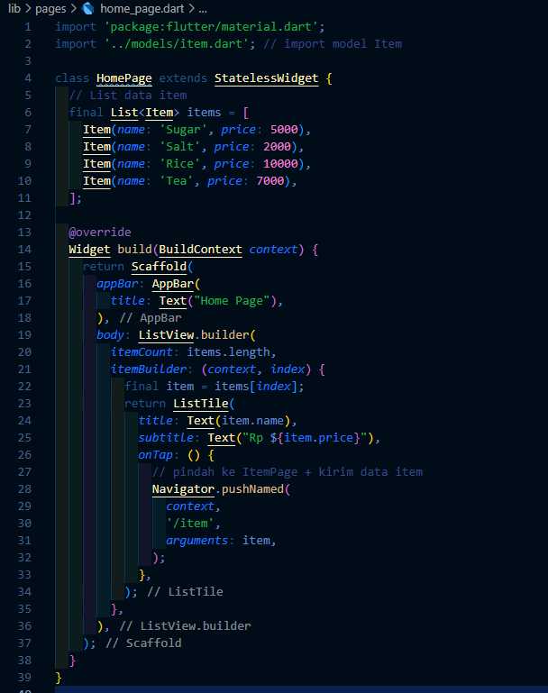
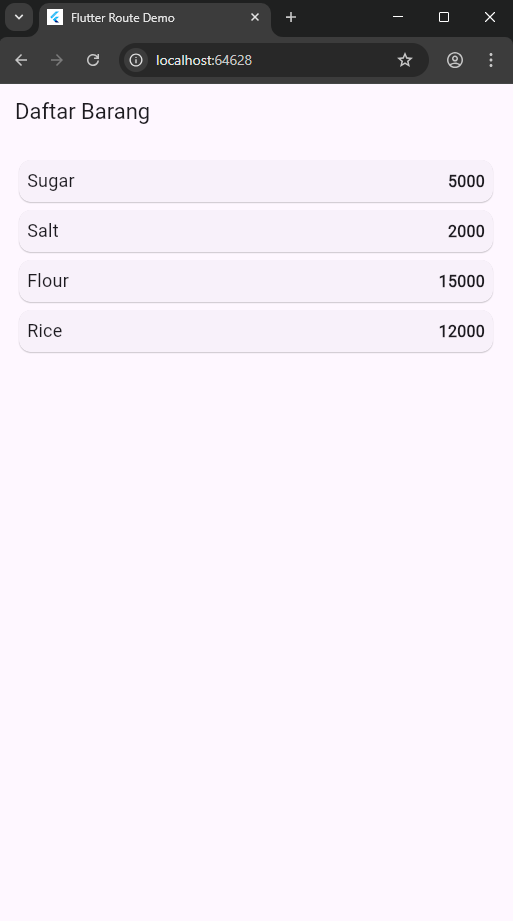
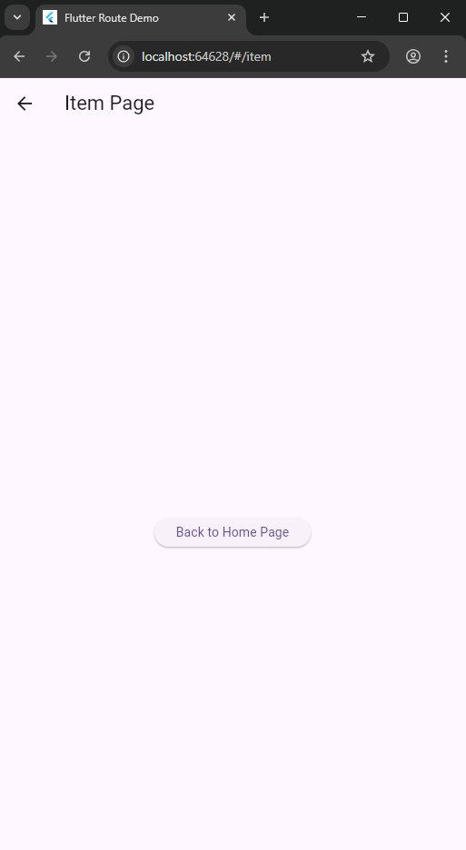
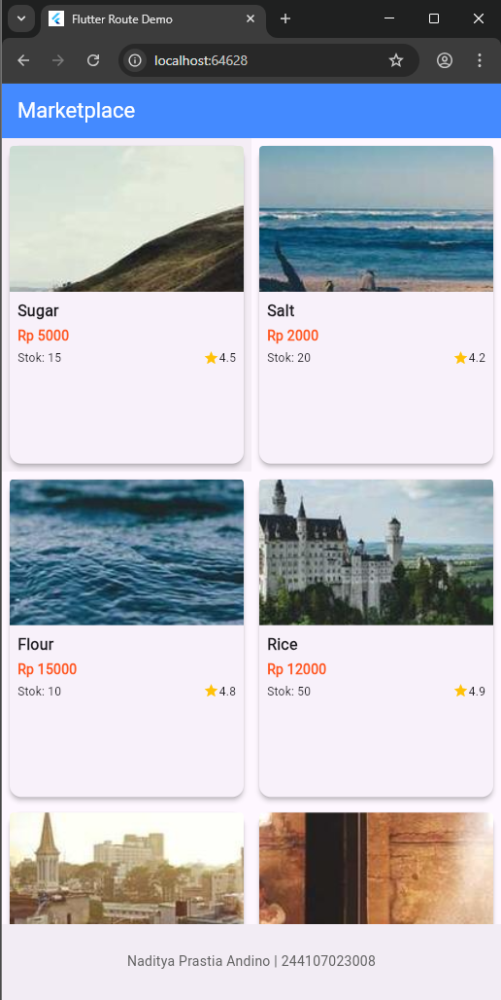
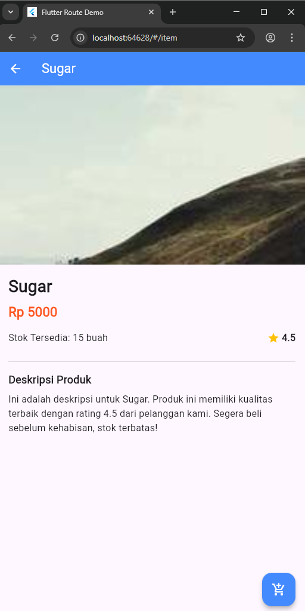

# 📘 Laporan Praktikum Flutter: Navigasi dengan Route

  
  **Nama**  : Naditya Prastia Andino
  **NIM**   : 244107023008
  **Kelas** : TI-3H  

## **Langkah 1: Persiapan Project**

Buat project Flutter baru dan pastikan struktur folder sudah seperti berikut:




---

## **Langkah 2: Mendefinisikan Route**

Buat dua file baru pada folder `pages`:

* `home_page.dart`
* `item_page.dart`

Kemudian deklarasikan `class HomePage` dan `class ItemPage` dengan turunan dari `StatelessWidget`.

📂 **home_page.dart**



📂 **item_page.dart**



---

## **Langkah 3: Lengkapi Kode di main.dart**

Buka file `main.dart` (di dalam folder `widgets`) lalu ubah agar mendefinisikan `routes`.

📂 **main.dart**



---

## **Langkah 4: Membuat Data Model**

Sebelum melakukan perpindahan halaman dengan data, kita butuh model.
Buat file `item.dart` pada folder `models`.

📂 **item.dart**

```dart
class Item {
  String name;
  int price;

  Item({required this.name, required this.price});
}
```

---

## **Langkah 5: Melengkapi Kode di HomePage**

Pada halaman `HomePage`, tampilkan daftar `Item` dengan `ListView`.
Jika salah satu item ditekan, kirim datanya ke `ItemPage` menggunakan `Navigator.pushNamed`.

📂 **home_page.dart (versi lengkap)**



---
## **Langkah 6: Membuat ListView dan itemBuilder**

Untuk menampilkan ListView pada praktikum ini digunakan itemBuilder. Data diambil dari definisi model yang telah dibuat sebelumnya. Untuk menunjukkan batas data satu dan berikutnya digunakan widget Card. Kode yang telah umum pada bagian ini tidak ditampilkan. Gambaran kode yang dibutuhkan dapat anda lihat sebagai berikut.

Jalankan aplikasi pada emulator atau pada device anda.

📂 **home_page.dart (versi lengkap)**

```dart
import 'package:flutter/material.dart';
import '../models/item.dart'; // import model Item

class HomePage extends StatelessWidget {
  final List<Item> items = [
    Item(name: 'Sugar', price: 5000),
    Item(name: 'Salt', price: 2000),
    Item(name: 'Flour', price: 15000),
    Item(name: 'Rice', price: 12000),
  ];

  @override
  Widget build(BuildContext context) {
    return Scaffold(
      appBar: AppBar(title: Text("Daftar Barang")),
      body: Container(
        margin: EdgeInsets.all(8),
        child: ListView.builder(
          padding: EdgeInsets.all(8),
          itemCount: items.length,
          itemBuilder: (context, index) {
            final item = items[index];
            return Card(
              child: Container(
                margin: EdgeInsets.all(8),
                child: Row(
                  children: [
                    Expanded(
                      child: Text(
                        item.name,
                        style: TextStyle(fontSize: 18),
                      ),
                    ),
                    Expanded(
                      child: Text(
                        item.price.toString(),
                        textAlign: TextAlign.end,
                        style: TextStyle(fontSize: 16, fontWeight: FontWeight.bold),
                      ),
                    ),
                  ],
                ),
              ),
            );
          },
        ),
      ),
    );
  }
}
```




---
## **10. Tugas Praktikum 2**




---
