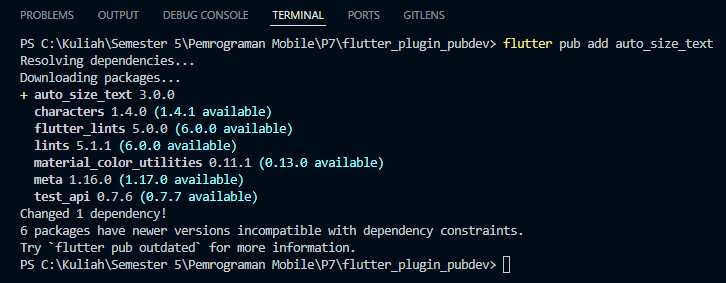
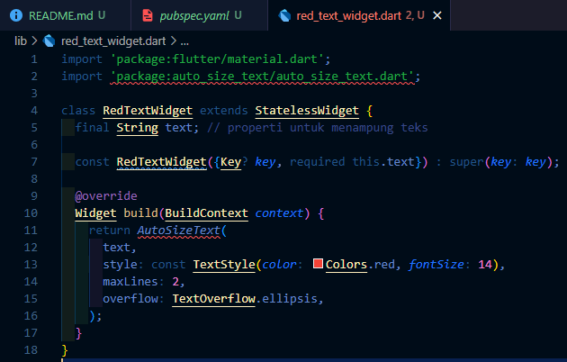
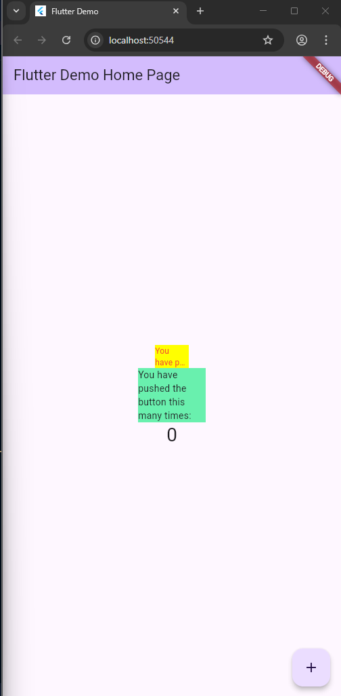

Berikut laporan praktikum kamu dalam format **Markdown (.md)** sesuai langkah-langkah di atas 👇

---

# 🧪 Praktikum 7: Menerapkan Plugin di Project Flutter

## 🎯 Tujuan

Mempelajari cara menambahkan **plugin dari pub.dev** ke dalam project Flutter serta menggunakannya di dalam widget kustom.

---

## ⚙️ Langkah-Langkah Praktikum

### **Langkah 1: Buat Project Baru**

Buat project Flutter baru dengan nama:

```bash
flutter create flutter_plugin_pubdev
```

Kemudian jadikan repository di GitHub dengan nama **`flutter_plugin_pubdev`**.

---

### **Langkah 2: Menambahkan Plugin**

Tambahkan plugin **`auto_size_text`** menggunakan perintah berikut:

```bash
flutter pub add auto_size_text
```




Jika berhasil, maka pada file `pubspec.yaml` bagian `dependencies:` akan muncul baris seperti berikut:

```yaml
dependencies:
  flutter:
    sdk: flutter
  auto_size_text: ^3.0.0
```

---

### **Langkah 3: Buat File `red_text_widget.dart`**

Buat file baru di folder `lib` dengan nama `red_text_widget.dart`, kemudian isi dengan kode berikut:

```dart
import 'package:flutter/material.dart';

class RedTextWidget extends StatelessWidget {
  const RedTextWidget({Key? key}) : super(key: key);

  @override
  Widget build(BuildContext context) {
    return Container();
  }
}
```

---

### **Langkah 4: Tambah Widget AutoSizeText**

Masih di file `red_text_widget.dart`, ubah bagian `return Container();` menjadi:

```dart
return AutoSizeText(
  text,
  style: const TextStyle(color: Colors.red, fontSize: 14),
  maxLines: 2,
  overflow: TextOverflow.ellipsis,
);

```



#### 🧩 Penjelasan Error:

Setelah menambahkan kode di atas, akan muncul error:

```
Error: Undefined name 'text'.
```

**Penyebab:**
Variabel `text` belum pernah didefinisikan di dalam class `RedTextWidget`, sehingga Flutter tidak mengenali nilai apa yang harus ditampilkan oleh widget `AutoSizeText`.

**Solusi:**
Tambahkan variabel `text` sebagai properti di class dan jadikan parameter konstruktor.

---

### **Langkah 5: Buat Variabel `text` dan Parameter Constructor**

Perbaiki kode `red_text_widget.dart` menjadi:

```dart
import 'package:flutter/material.dart';
import 'package:auto_size_text/auto_size_text.dart';

class RedTextWidget extends StatelessWidget {
  final String text;

  const RedTextWidget({Key? key, required this.text}) : super(key: key);

  @override
  Widget build(BuildContext context) {
    return AutoSizeText(
      text,
      style: const TextStyle(color: Colors.red, fontSize: 14),
      maxLines: 2,
      overflow: TextOverflow.ellipsis,
    );
  }
}
```

Dengan menambahkan properti `text`, error akan hilang dan widget dapat menampilkan teks secara otomatis menyesuaikan ukuran font.

---

### **Langkah 6: Tambahkan Widget di `main.dart`**

Buka file `main.dart`, kemudian tambahkan widget berikut di dalam `children:` pada class `_MyHomePageState`:

```dart
import 'package:flutter/material.dart';
import 'red_text_widget.dart'; // ✅ impor file red_text_widget.dart

void main() {
  runApp(const MyApp());
}

class MyApp extends StatelessWidget {
  const MyApp({super.key});

  @override
  Widget build(BuildContext context) {
    return MaterialApp(
      title: 'Flutter Demo',
      theme: ThemeData(
        colorScheme: ColorScheme.fromSeed(seedColor: Colors.deepPurple),
      ),
      home: const MyHomePage(title: 'Flutter Demo Home Page'),
    );
  }
}

class MyHomePage extends StatefulWidget {
  const MyHomePage({super.key, required this.title});
  final String title;

  @override
  State<MyHomePage> createState() => _MyHomePageState();
}

class _MyHomePageState extends State<MyHomePage> {
  int _counter = 0;

  void _incrementCounter() {
    setState(() {
      _counter++;
    });
  }

  @override
  Widget build(BuildContext context) {
    return Scaffold(
      appBar: AppBar(
        backgroundColor: Theme.of(context).colorScheme.inversePrimary,
        title: Text(widget.title),
      ),
      body: Center(
        child: Column(
          mainAxisAlignment: MainAxisAlignment.center,
          children: <Widget>[
            // 🟡 Tambahkan widget dari langkah 6 di bawah ini
            Container(
              color: Colors.yellowAccent,
              width: 50,
              child: const RedTextWidget(
                text: 'You have pushed the button this many times:',
              ),
            ),
            Container(
              color: Colors.greenAccent,
              width: 100,
              child: const Text(
                'You have pushed the button this many times:',
              ),
            ),
            // 🔢 Teks counter asli bawaan Flutter
            Text(
              '$_counter',
              style: Theme.of(context).textTheme.headlineMedium,
            ),
          ],
        ),
      ),
      floatingActionButton: FloatingActionButton(
        onPressed: _incrementCounter,
        tooltip: 'Increment',
        child: const Icon(Icons.add),
      ),
    );
  }
}

```

---

## ▶️ Menjalankan Aplikasi

Jalankan aplikasi dengan menekan tombol **F5** (atau perintah terminal berikut):

```bash
flutter run
```

---

## 📸 Hasil



Setelah dijalankan, akan muncul dua container:

* **Container kuning** menampilkan teks merah dengan widget `AutoSizeText`, yang otomatis menyesuaikan ukuran font agar tidak melebihi batas baris.
* **Container hijau** menampilkan teks biasa tanpa penyesuaian otomatis.

---

## 🧠 Kesimpulan

* Plugin **`auto_size_text`** berfungsi untuk **menyesuaikan ukuran teks secara otomatis** agar muat di dalam area widget.
* Error pada langkah awal terjadi karena variabel `text` belum dideklarasikan.
* Dengan menambahkan variabel dan parameter constructor, widget dapat menerima teks dari luar dan menampilkannya dengan benar.

---


## 📝 Jawaban Tugas Praktikum

### 🔹 1. Maksud dari Langkah 2

Langkah 2 bertujuan untuk **menambahkan plugin eksternal dari pub.dev** ke dalam proyek Flutter.
Perintah:

```bash
flutter pub add auto_size_text
```

berfungsi untuk menambahkan dependensi `auto_size_text` secara otomatis ke dalam file `pubspec.yaml`.
Plugin ini akan diunduh dan bisa digunakan di seluruh project Flutter.
Dengan cara ini, developer dapat memanfaatkan library pihak ketiga tanpa harus menulis ulang fitur dari nol.

---

### 🔹 2. Maksud dari Langkah 5

Langkah 5 bertujuan untuk **mendefinisikan variabel `text`** agar widget `RedTextWidget` dapat menerima nilai teks dari luar class.

Dengan menulis:

```dart
final String text;
const RedTextWidget({Key? key, required this.text}) : super(key: key);
```

Artinya:

* `final String text;` → mendeklarasikan variabel untuk menyimpan teks.
* `required this.text` → menjadikan parameter `text` **wajib diisi** saat widget dipanggil.

Hal ini membuat widget menjadi **dinamis** dan **dapat digunakan ulang** untuk teks berbeda.

---

### 🔹 3. Fungsi dan Perbedaan Dua Widget di Langkah 6

| Widget                                     | Fungsi                                                                                                           | Ciri / Perbedaan                                                                                    |
| ------------------------------------------ | ---------------------------------------------------------------------------------------------------------------- | --------------------------------------------------------------------------------------------------- |
| 🟡 `RedTextWidget` (dengan `AutoSizeText`) | Menampilkan teks berwarna merah yang **otomatis menyesuaikan ukuran font** agar teks tetap muat dalam container. | Menggunakan plugin `auto_size_text`, sehingga teks akan **mengecil otomatis** jika terlalu panjang. |
| 🟢 `Text` biasa                            | Menampilkan teks statis tanpa penyesuaian ukuran otomatis.                                                       | Jika teks terlalu panjang, teks bisa **terpotong atau meluber** dari container.                     |

---

### 🔹 4. Penjelasan Parameter Plugin `AutoSizeText`

Berdasarkan dokumentasi resmi [auto_size_text](https://pub.dev/packages/auto_size_text):

| Parameter                      | Fungsi                                                                                                                     |
| ------------------------------ | -------------------------------------------------------------------------------------------------------------------------- |
| `text`                         | Isi teks yang ingin ditampilkan.                                                                                           |
| `style`                        | Mengatur gaya teks (warna, ukuran, font).                                                                                  |
| `maxLines`                     | Menentukan jumlah maksimal baris teks yang ditampilkan. Jika teks melebihi batas ini, maka akan disingkat.                 |
| `overflow`                     | Menentukan cara penanganan teks berlebih, misalnya `TextOverflow.ellipsis` untuk menambahkan titik tiga (…) di akhir teks. |
| *(opsional)* `minFontSize`     | Ukuran font minimum saat teks diperkecil otomatis.                                                                         |
| *(opsional)* `maxFontSize`     | Ukuran font maksimum yang boleh digunakan.                                                                                 |
| *(opsional)* `stepGranularity` | Mengatur seberapa besar perubahan ukuran font saat disesuaikan.                                                            |
| *(opsional)* `presetFontSizes` | Daftar ukuran font yang dapat dicoba secara berurutan agar teks pas.                                                       |

---


