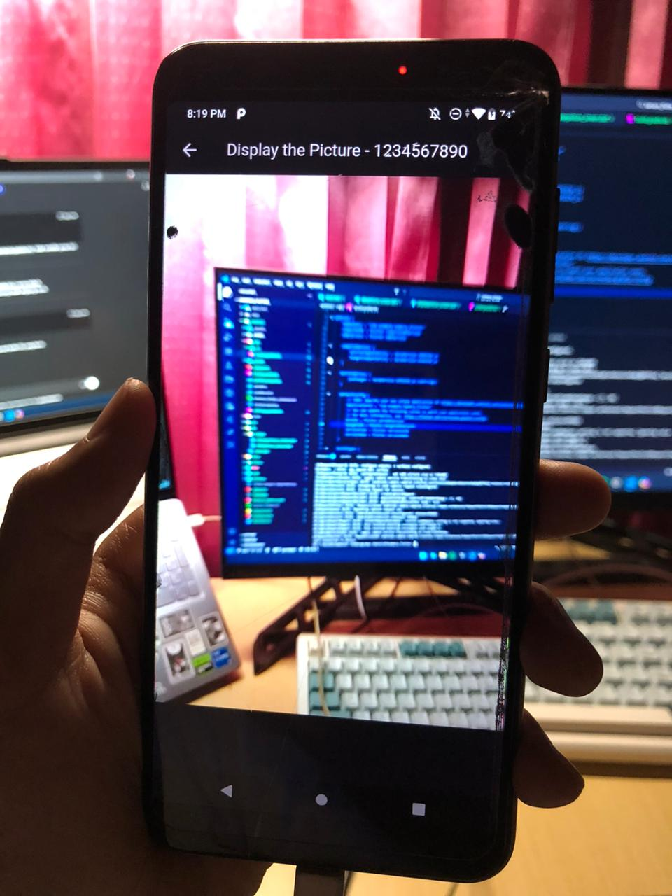
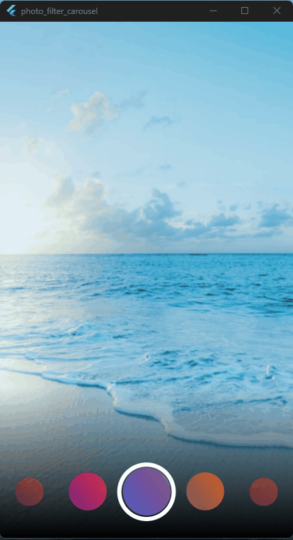
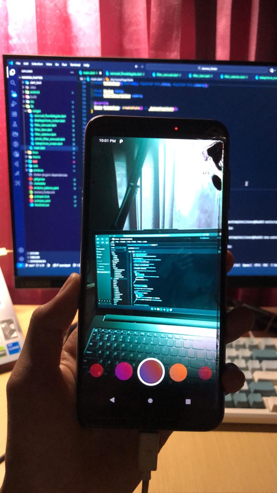

# Praktikum Pemrograman Mobile

**Nama**  : Naditya Prastia Andino
**NIM**   : 244107023008
**Kelas** : TI-3H

---

## **Praktikum 1**

### 🎯 Tujuan Praktikum

Membuat aplikasi Flutter yang dapat **mengambil foto melalui kamera** dan menampilkannya di layar perangkat.

### 🔧 Langkah-Langkah Praktikum

1. **Membuat Proyek Flutter Baru**

   * Membuat proyek baru dengan nama `kamera_flutter` menggunakan perintah:

     ```bash
     flutter create kamera_flutter
     cd kamera_flutter
     ```

2. **Menambahkan Dependency yang Diperlukan**

   * Menambahkan plugin kamera dan pendukung penyimpanan file:

     ```bash
     flutter pub add camera path_provider path
     ```

3. **Menambahkan Izin Akses Kamera (Permissions)**

   * Menambahkan pengaturan permission pada file `Info.plist` (untuk iOS) agar aplikasi dapat mengakses kamera dan mikrofon.

4. **Inisialisasi Kamera di Fungsi Main**

   * Menginisialisasi kamera secara asinkron dalam fungsi `main()` untuk mendapatkan daftar kamera yang tersedia.

5. **Membuat Widget untuk Mengambil dan Menampilkan Foto**

   * Membuat widget `TakePictureScreen` untuk menangkap foto.
   * Membuat widget `DisplayPictureScreen` untuk menampilkan hasil foto yang sudah diambil.

6. **Menambahkan Tombol Pengambil Gambar**

   * Menggunakan `FloatingActionButton` untuk mengambil gambar ketika tombol ditekan.

7. **Menampilkan Foto yang Telah Diambil**

   * Setelah foto berhasil diambil, hasilnya ditampilkan di halaman baru menggunakan `Navigator` dan widget `Image.file`.

### 📱 Output Praktikum

Berikut contoh tampilan hasil dari praktikum ketika aplikasi berhasil mengambil dan menampilkan foto dari kamera:



---

## **Praktikum 2**

### 🎯 Tujuan Praktikum

Membuat aplikasi Flutter yang dapat **menampilkan filter warna** pada foto dan memungkinkan pengguna mengganti filter dengan **efek carousel interaktif**.

### 🔧 Langkah-Langkah Praktikum

1. **Membuat Proyek Baru**

   * Membuat proyek baru dengan nama `photo_filter_carousel`.

2. **Membuat Folder Widget**

   * Membuat folder `widget` di dalam folder `lib` untuk menyimpan berbagai file widget kustom.

3. **Membuat Widget FilterSelector**

   * File: `lib/widget/filter_selector.dart`
   * Widget ini berfungsi menampilkan deretan filter warna dalam bentuk carousel yang bisa digeser, dilengkapi dengan efek bayangan dan cincin penanda filter aktif.

4. **Membuat Widget PhotoFilterCarousel**

   * File: `lib/widget/filter_carousel.dart`
   * Widget utama untuk menampilkan foto yang dapat diberi berbagai efek filter.
   * Menggunakan `ValueNotifier` dan `ValueListenableBuilder` agar perubahan filter langsung diterapkan secara real-time.

5. **Membuat Flow Delegate untuk Carousel**

   * File: `lib/widget/carousel_flowdelegate.dart`
   * Mengatur animasi dan transformasi visual (skala, posisi, dan transparansi) dari setiap filter saat carousel digeser.

6. **Membuat Widget FilterItem**

   * File: `lib/widget/filter_item.dart`
   * Menampilkan satu elemen filter (lingkaran dengan warna dan tekstur overlay).

7. **Menggabungkan Semua Widget ke Main**

   * Mengimpor semua file widget ke `main.dart` dan menampilkan `PhotoFilterCarousel` sebagai tampilan utama aplikasi.

### 📱 Output Praktikum

Berikut hasil ketika carousel filter berhasil dijalankan dan berfungsi dengan baik di aplikasi:


### 🧩 Penjelasan & Uji Kode

* Carousel menampilkan beberapa pilihan filter warna yang bisa dipilih untuk mengubah tampilan foto utama.
* Efek **skala dan transparansi (opacity)** memberikan efek visual seperti 3D carousel.
* Cincin seleksi dan bayangan gradasi menandai filter yang sedang aktif.

---

## **Tugas Praktikum**

1. **Menyelesaikan Praktikum 1 dan 2**

   * Seluruh hasil pekerjaan telah didokumentasikan dan diunggah ke repository GitHub beserta penjelasan serta screenshot pada file `README.md`.
   * Setiap error telah diperbaiki agar aplikasi berjalan sesuai fungsi yang diharapkan.

2. **Menggabungkan Praktikum 1 dan 2**

   * Hasil penggabungan telah dilakukan dalam satu proyek (`kamera_flutter`).
   * Setelah mengambil foto menggunakan kamera, pengguna dapat langsung menerapkan filter carousel pada foto tersebut.

   

3. **Penjelasan Maksud `void async` pada Praktikum 1**

   Pada praktikum pertama, fungsi `main()` dibuat seperti berikut:

   ```dart
   void main() async {
     final cameras = await availableCameras();
     ...
   }
   ```

   **Penjelasan:**

   * Keyword `async` menandakan bahwa fungsi tersebut dapat menjalankan operasi **asinkron**.
   * Dengan `async`, kita dapat menggunakan keyword `await` di dalam fungsi untuk menunggu hasil proses yang memerlukan waktu (seperti mengambil daftar kamera).
   * Tujuannya agar aplikasi tidak berhenti (non-blocking) saat proses tersebut dijalankan.

   **Kesimpulan:**
   `async` digunakan agar fungsi `main()` dapat menunggu hasil dari proses asinkron seperti `availableCameras()` sebelum aplikasi diluncurkan.

4. **Penjelasan Fungsi Anotasi `@immutable` dan `@override`**

   ### a. `@immutable`

   * **Makna:** Menandakan bahwa semua atribut dalam suatu class tidak boleh diubah setelah objek dibuat.
   * **Fungsi:** Digunakan untuk menegakkan prinsip *immutability* terutama pada `StatelessWidget`.
   * **Manfaat:** Membantu Dart analyzer mendeteksi kesalahan jika ada field yang diubah setelah inisialisasi.

   ### b. `@override`

   * **Makna:** Menunjukkan bahwa method tersebut merupakan hasil penulisan ulang (override) dari method yang sudah ada di superclass.
   * **Fungsi:** Memberi kejelasan kode dan memastikan bahwa method yang ditulis memang cocok dengan definisi superclass.
   * **Contoh:**

     ```dart
     @override
     Widget build(BuildContext context) {
       return Scaffold(...);
     }
     ```

5. **Penyerahan Tugas**

   * Link commit dan repository GitHub telah dikumpulkan kepada dosen sesuai dengan instruksi yang telah ditetapkan.

---
