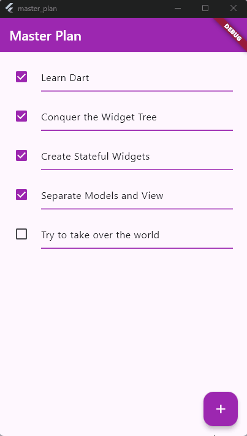

# 🧩 Praktikum 1 – Dasar State dengan Model-View

## 📱 Aplikasi: **Master Plan**

Proyek ini membuat aplikasi sederhana untuk mencatat dan menandai tugas menggunakan pendekatan **state management dasar (setState)** dengan struktur **Model–View**.!

---

## 📁 Struktur Folder Proyek

```
master_plan/
├── lib/
│   ├── models/
│   │   ├── task.dart
│   │   ├── plan.dart
│   │   └── data_layer.dart
│   └── views/
│       └── plan_screen.dart
│   └── main.dart
├── pubspec.yaml
```

---

## ⚙️ Langkah 1 – `main.dart`

File ini adalah **entry point** aplikasi.
Menjalankan `MasterPlanApp` dengan tema ungu dan layar utama `PlanScreen`.

```dart
import 'package:flutter/material.dart';
import './views/plan_screen.dart';

void main() => runApp(const MasterPlanApp());

class MasterPlanApp extends StatelessWidget {
  const MasterPlanApp({super.key});

  @override
  Widget build(BuildContext context) {
    return MaterialApp(
      theme: ThemeData(primarySwatch: Colors.purple),
      home: const PlanScreen(),
    );
  }
}
```

📝 **Penjelasan:**

* `MaterialApp` digunakan sebagai root widget.
* `PlanScreen()` adalah tampilan utama aplikasi.
* `primarySwatch` menentukan warna tema utama aplikasi.

---

## 📄 Langkah 2 – `models/task.dart`

Model ini merepresentasikan **satu tugas (Task)** dalam aplikasi.

```dart
class Task {
  final String description;
  final bool complete;

  const Task({
    this.complete = false,
    this.description = '',
  });
}
```

📝 **Penjelasan:**

* `Task` bersifat immutable (menggunakan `final`).
* Properti:

  * `description`: deskripsi tugas.
  * `complete`: status apakah tugas sudah selesai.

---

## 📄 Langkah 3 – `models/plan.dart`

Model ini menyimpan daftar `Task` di dalam satu `Plan`.

```dart
import './task.dart';

class Plan {
  final String name;
  final List<Task> tasks;

  const Plan({this.name = '', this.tasks = const []});
}
```

📝 **Penjelasan:**

* `Plan` juga immutable.
* Menampung:

  * `name`: nama rencana.
  * `tasks`: daftar tugas yang termasuk dalam rencana tersebut.

---

## 📄 Langkah 4 – `models/data_layer.dart`

File ini mengekspor semua model agar mudah diimpor di file lain.

```dart
export 'plan.dart';
export 'task.dart';
```

📝 **Penjelasan:**

* Berguna untuk impor singkat:

  ```dart
  import '../models/data_layer.dart';
  ```

  tanpa harus impor `task.dart` dan `plan.dart` satu per satu.

---

## 🧠 Langkah 5 – `views/plan_screen.dart`

Berisi logika dan tampilan utama (View).
Mengelola state `Plan` dan daftar `Task`.

```dart
import '../models/data_layer.dart';
import 'package:flutter/material.dart';

class PlanScreen extends StatefulWidget {
  const PlanScreen({super.key});

  @override
  State createState() => _PlanScreenState();
}

class _PlanScreenState extends State<PlanScreen> {
  Plan plan = const Plan();
  late ScrollController scrollController;

  @override
  void initState() {
    super.initState();
    scrollController = ScrollController()
      ..addListener(() {
        // Hilangkan fokus TextField ketika di-scroll
        FocusScope.of(context).requestFocus(FocusNode());
      });
  }

  @override
  void dispose() {
    scrollController.dispose();
    super.dispose();
  }

  @override
  Widget build(BuildContext context) {
    return Scaffold(
      appBar: AppBar(title: const Text('Master Plan Naditya')), // Ganti 'Naditya' dengan namamu
      body: _buildList(),
      floatingActionButton: _buildAddTaskButton(),
    );
  }

  // 🔹 Tombol Tambah Task
  Widget _buildAddTaskButton() {
    return FloatingActionButton(
      child: const Icon(Icons.add),
      onPressed: () {
        setState(() {
          plan = Plan(
            name: plan.name,
            tasks: List<Task>.from(plan.tasks)..add(const Task()),
          );
        });
      },
    );
  }

  // 🔹 ListView untuk menampilkan semua task
  Widget _buildList() {
    return ListView.builder(
      controller: scrollController,
      keyboardDismissBehavior:
          Theme.of(context).platform == TargetPlatform.iOS
              ? ScrollViewKeyboardDismissBehavior.onDrag
              : ScrollViewKeyboardDismissBehavior.manual,
      itemCount: plan.tasks.length,
      itemBuilder: (context, index) =>
          _buildTaskTile(plan.tasks[index], index),
    );
  }

  // 🔹 Widget untuk setiap task
  Widget _buildTaskTile(Task task, int index) {
    return ListTile(
      leading: Checkbox(
        value: task.complete,
        onChanged: (selected) {
          setState(() {
            plan = Plan(
              name: plan.name,
              tasks: List<Task>.from(plan.tasks)
                ..[index] = Task(
                  description: task.description,
                  complete: selected ?? false,
                ),
            );
          });
        },
      ),
      title: TextFormField(
        initialValue: task.description,
        onChanged: (text) {
          setState(() {
            plan = Plan(
              name: plan.name,
              tasks: List<Task>.from(plan.tasks)
                ..[index] = Task(
                  description: text,
                  complete: task.complete,
                ),
            );
          });
        },
      ),
    );
  }
}
```

---

## 🧩 Penjelasan Detail `PlanScreen`

| Bagian                        | Fungsi               | Penjelasan                                               |
| ----------------------------- | -------------------- | -------------------------------------------------------- |
| `Plan plan`                   | State utama          | Menyimpan semua task dalam satu plan                     |
| `_buildAddTaskButton()`       | Tombol tambah task   | Menambahkan `Task()` baru ke dalam `plan.tasks`          |
| `_buildList()`                | Tampilan daftar task | Menggunakan `ListView.builder` agar bisa scroll          |
| `_buildTaskTile()`            | Elemen tiap task     | Menampilkan checkbox dan `TextFormField` untuk deskripsi |
| `ScrollController`            | Kontrol scrolling    | Menghapus fokus saat user scroll agar keyboard tertutup  |
| `initState()` dan `dispose()` | Lifecycle            | Menginisialisasi dan membersihkan controller             |

---

## 🧠 Konsep State Management yang Digunakan

🟣 **StatefulWidget + setState()**

* Digunakan untuk memperbarui tampilan setiap kali data `plan` berubah.
* Contoh:

  ```dart
  setState(() {
    plan = Plan(...);
  });
  ```

  akan menyebabkan UI rebuild dengan data terbaru.

---

## 🧪 Output Praktikum 1



---


# 🧩 Tugas Praktikum 1: Dasar State dengan Model-View

## 📘 Dasar Manajemen State di Flutter

Pada praktikum ini, dipelajari konsep dasar manajemen state dengan pendekatan **Model-View**, di mana logika aplikasi dan data dipisahkan dari tampilan (UI). Tujuannya agar aplikasi mudah dikembangkan, dipelihara, dan diuji.

---

## 🎯 Tujuan

* Memahami **stateful widget** dan bagaimana data dapat dikelola di dalamnya.
* Menggunakan **model data (Plan)** untuk memisahkan data dari tampilan.
* Menampilkan daftar *task* dan jumlah task yang selesai secara dinamis.

---

## 🧩 Penjelasan Setiap Langkah Penting

### 🔹 Langkah 4 – Penjelasan Maksud dan Tujuan

Pada langkah ini, dilakukan pemisahan antara **View (UI)** dan **Model (data)** dengan membuat kelas model, misalnya:

```dart
class Plan {
  final String name;
  final List<Task> tasks;

  const Plan({required this.name, required this.tasks});
}
```

📖 **Maksudnya:**
Langkah ini bertujuan agar data (`Plan` dan `Task`) tidak disimpan langsung di dalam widget, tetapi dalam kelas terpisah.

💡 **Mengapa dilakukan demikian:**
Supaya ketika tampilan berubah, data tetap konsisten dan dapat digunakan kembali tanpa harus membuat ulang.
Dengan kata lain, langkah ini membentuk **struktur arsitektur Model-View**, di mana:

* `Model` → berisi data dan logika,
* `View` → hanya menampilkan tampilan berdasarkan data model.

---

### 🔹 Langkah 6 – Variabel `plan`

Contoh kode:

```dart
final plan = Plan(
  name: 'Master Plan',
  tasks: [],
);
```

📖 **Mengapa diperlukan variabel `plan`:**
Variabel ini digunakan untuk menyimpan instance data dari kelas `Plan` yang menjadi *sumber state utama* di aplikasi.
Semua data task dan perubahannya akan mengacu pada `plan`.

💡 **Mengapa dibuat sebagai konstanta (`const`)**
Karena `Plan` tidak berubah pada saat inisialisasi — struktur datanya tetap.
Yang berubah hanyalah isi dari daftar `tasks` di dalamnya, bukan objek `Plan` itu sendiri.
Dengan menjadikannya `const`, Flutter dapat melakukan optimasi performa karena objek tersebut tidak perlu dibuat ulang setiap kali build dijalankan.

---

### 🔹 Langkah 9 – Capture Hasil Akhir

| Tampilan                                       | Deskripsi                                                                                                                                        |
| ---------------------------------------------- | ------------------------------------------------------------------------------------------------------------------------------------------------ |
|  | Aplikasi menampilkan halaman utama berjudul **Master Plan**, tombol **“+”** untuk menambah task baru, dan indikator jumlah task di bagian bawah. |

📸 **Penjelasan Hasil:**

* Tampilan terdiri dari **AppBar**, **ListView task**, **FloatingActionButton (+)**, dan **footer counter**.
* Saat tombol `+` ditekan, pengguna dapat menambah task baru.
* Jumlah task dan status selesai akan otomatis diperbarui di tampilan bawah.
* Warna ungu digunakan sebagai tema utama (`Colors.purple`).

---

### 🔹 Langkah 11 dan 13 – Lifecycle State

#### 🔸 Langkah 11 – `initState()`

```dart
@override
void initState() {
  super.initState();
  // Inisialisasi data awal
}
```

📖 **Kegunaan:**
`initState()` dipanggil **sekali** ketika widget pertama kali dibuat.
Digunakan untuk **inisialisasi data awal**, seperti membuat instance `plan` atau menyiapkan listener.

---

#### 🔸 Langkah 13 – `setState()`

```dart
setState(() {
  // update tampilan setelah data berubah
});
```

📖 **Kegunaan:**
`setState()` memberi tahu Flutter bahwa data (state) di dalam widget telah berubah, sehingga **UI perlu di-*rebuild*** dengan data terbaru.

💡 **Mengapa dilakukan demikian:**
Tanpa `setState()`, perubahan data pada variabel seperti `plan.tasks` tidak akan muncul di layar karena Flutter tidak tahu bahwa perlu memperbarui tampilan.

---

## 📂 Struktur Folder

```
lib/
 ├── main.dart
 ├── models/
 │    ├── plan.dart
 │    └── task.dart
 ├── screens/
 │    └── plan_screen.dart
 └── widgets/
      └── task_list.dart
```

---

## ✅ Kesimpulan

* Praktikum ini memperkenalkan pola **Model-View** untuk memisahkan data dari tampilan.
* Variabel `plan` digunakan untuk menyimpan data utama (state).
* Lifecycle method `initState()` digunakan untuk inisialisasi awal.
* `setState()` digunakan untuk memperbarui tampilan ketika data berubah.
* Hasil akhir menunjukkan aplikasi sederhana yang dapat menambah dan menampilkan daftar task dengan state yang terkelola dengan baik.

---


# 🧩 Praktikum 2: Mengelola Data Layer dengan InheritedWidget dan InheritedNotifier

## 🎯 Tujuan

Menerapkan **InheritedWidget** dan **InheritedNotifier** untuk memisahkan *data layer* (model) dari *view layer* (UI) pada aplikasi **Master Plan**.

---

## 📁 Langkah 1: Buat File `plan_provider.dart`

Buat folder baru bernama `provider` di dalam folder `lib`, lalu buat file baru bernama:

```
lib/provider/plan_provider.dart
```

Isi dengan kode berikut:

```dart
import 'package:flutter/material.dart';
import '../models/data_layer.dart';

class PlanProvider extends InheritedNotifier<ValueNotifier<Plan>> {
  const PlanProvider({
    super.key,
    required Widget child,
    required ValueNotifier<Plan> notifier,
  }) : super(child: child, notifier: notifier);

  static ValueNotifier<Plan> of(BuildContext context) {
    return context.dependOnInheritedWidgetOfExactType<PlanProvider>()!.notifier!;
  }
}
```

> ✅ Fungsi `PlanProvider` adalah “jembatan” untuk meneruskan data `Plan` ke seluruh widget turunannya.

---

## 🧱 Langkah 2: Edit `main.dart`

Buka file `lib/main.dart`, dan ubah atribut `home` pada `MaterialApp` agar menggunakan `PlanProvider`.

```dart
import 'package:flutter/material.dart';
import 'models/data_layer.dart';
import 'provider/plan_provider.dart';
import 'views/plan_screen.dart';

void main() {
  runApp(const MasterPlanApp());
}

class MasterPlanApp extends StatelessWidget {
  const MasterPlanApp({super.key});

  @override
  Widget build(BuildContext context) {
    return MaterialApp(
      debugShowCheckedModeBanner: false,
      theme: ThemeData(primarySwatch: Colors.purple),
      home: PlanProvider(
        notifier: ValueNotifier<Plan>(const Plan()),
        child: const PlanScreen(),
      ),
    );
  }
}
```

---

## 📘 Langkah 3: Tambah Method di `plan.dart`

Buka file `lib/models/data_layer.dart` (atau `plan.dart` jika dipisah).
Tambahkan dua getter berikut di dalam class `Plan`:

```dart
int get completedCount => tasks.where((task) => task.complete).length;

String get completenessMessage =>
    '$completedCount out of ${tasks.length} tasks';
```

> ✅ Ini digunakan untuk menghitung jumlah *task* yang selesai dan menampilkan progress di bagian bawah.

---

## 📄 Langkah 4: Hapus Variabel `plan` di `PlanScreen`

Buka file:

```
lib/views/plan_screen.dart
```

Hapus variabel lokal:

```dart
Plan plan = const Plan(...);
```

> Kita tidak lagi menyimpan data di dalam `PlanScreen`, tapi menggunakan data dari `PlanProvider`.

---

## 🧮 Langkah 5: Edit `_buildAddTaskButton()`

Tambahkan parameter `BuildContext` dan ubah agar mengambil data dari `PlanProvider`:

```dart
Widget _buildAddTaskButton(BuildContext context) {
  ValueNotifier<Plan> planNotifier = PlanProvider.of(context);
  return FloatingActionButton(
    backgroundColor: Colors.purple,
    child: const Icon(Icons.add, color: Colors.white),
    onPressed: () {
      Plan currentPlan = planNotifier.value;
      planNotifier.value = Plan(
        name: currentPlan.name,
        tasks: List<Task>.from(currentPlan.tasks)..add(const Task()),
      );
    },
  );
}
```

---

## 🧱 Langkah 6: Edit `_buildTaskTile()`

Tambahkan parameter `BuildContext`, dan gunakan `PlanProvider` sebagai sumber data.
Ganti `TextField` menjadi `TextFormField` agar bisa memudahkan pembaruan data.

```dart
Widget _buildTaskTile(Task task, int index, BuildContext context) {
  ValueNotifier<Plan> planNotifier = PlanProvider.of(context);

  return ListTile(
    leading: Checkbox(
      activeColor: Colors.purple,
      value: task.complete,
      onChanged: (selected) {
        Plan currentPlan = planNotifier.value;
        planNotifier.value = Plan(
          name: currentPlan.name,
          tasks: List<Task>.from(currentPlan.tasks)
            ..[index] = Task(
              description: task.description,
              complete: selected ?? false,
            ),
        );
      },
    ),
    title: TextFormField(
      initialValue: task.description,
      decoration: const InputDecoration(
        enabledBorder: UnderlineInputBorder(
          borderSide: BorderSide(color: Colors.purple, width: 1.5),
        ),
        focusedBorder: UnderlineInputBorder(
          borderSide: BorderSide(color: Colors.purple, width: 2),
        ),
        hintText: 'Enter task...',
      ),
      onChanged: (text) {
        Plan currentPlan = planNotifier.value;
        planNotifier.value = Plan(
          name: currentPlan.name,
          tasks: List<Task>.from(currentPlan.tasks)
            ..[index] = Task(
              description: text,
              complete: task.complete,
            ),
        );
      },
    ),
  );
}
```

---

## 🪣 Langkah 7: Edit `_buildList()`

Sesuaikan agar `_buildTaskTile` menerima `context`.

```dart
Widget _buildList(Plan plan) {
  return ListView.builder(
    controller: scrollController,
    itemCount: plan.tasks.length,
    itemBuilder: (context, index) =>
        _buildTaskTile(plan.tasks[index], index, context),
  );
}
```

---

## 🏗️ Langkah 8–9: Edit Method `build()`

Sekarang ubah method `build` agar menampilkan *progress message* di bawah daftar menggunakan `SafeArea`.

```dart
@override
Widget build(BuildContext context) {
  return Scaffold(
    appBar: AppBar(
      title: const Text(
        'Master Plan',
        style: TextStyle(color: Colors.white),
      ),
      backgroundColor: Colors.purple,
    ),
    body: ValueListenableBuilder<Plan>(
      valueListenable: PlanProvider.of(context),
      builder: (context, plan, child) {
        return Column(
          children: [
            Expanded(child: _buildList(plan)),
            SafeArea(
              child: Padding(
                padding: const EdgeInsets.all(8.0),
                child: Text(
                  plan.completenessMessage,
                  style: const TextStyle(
                    fontWeight: FontWeight.w600,
                    color: Colors.purple,
                  ),
                ),
              ),
            ),
          ],
        );
      },
    ),
    floatingActionButton: _buildAddTaskButton(context),
  );
}
```

---

## 📱 Output Praktikum 2


---
# 🧩 Tugas Praktikum 2: InheritedWidget

## 📘 Dasar Manajemen State di Flutter

Pada praktikum ini, kami mempelajari cara **memisahkan data (state) dari tampilan (view)** menggunakan **InheritedWidget** dan **InheritedNotifier** agar manajemen data lebih efisien dan mudah dipelihara.

---

## 🎯 Tujuan

* Memahami konsep **State Management dasar** menggunakan InheritedWidget.
* Menerapkan **InheritedNotifier** untuk memisahkan model data (`Plan`) dari tampilan (`PlanScreen`).
* Menampilkan perubahan data secara reaktif pada UI tanpa perlu mengatur ulang seluruh struktur widget.

---

## 🧠 Penjelasan Konsep

### 1️⃣ Apa yang Dimaksud dengan **InheritedWidget**

`InheritedWidget` adalah kelas dasar di Flutter yang memungkinkan data diturunkan (*inherited*) dari parent ke child widget.
Widget ini memungkinkan *state* dibagikan ke banyak widget tanpa perlu melewatkan data secara eksplisit melalui constructor.

Namun, karena kita juga ingin **mendengarkan perubahan data (notifikasi)**, maka pada praktikum ini digunakan turunan yang lebih efisien, yaitu **InheritedNotifier**.

---

### 2️⃣ Mengapa Menggunakan **InheritedNotifier**

`InheritedNotifier` menggabungkan fungsi **InheritedWidget** dengan **ChangeNotifier**.
Artinya, ketika data pada `ValueNotifier` berubah, widget yang menggunakan `InheritedNotifier` akan **secara otomatis rebuild**.

Pada praktikum ini:

```dart
class PlanProvider extends InheritedNotifier<ValueNotifier<Plan>> {
  const PlanProvider({
    Key? key,
    required ValueNotifier<Plan> notifier,
    required Widget child,
  }) : super(key: key, notifier: notifier, child: child);

  static ValueNotifier<Plan> of(BuildContext context) {
    return context.dependOnInheritedWidgetOfExactType<PlanProvider>()!.notifier!;
  }
}
```

📌 **Alasan:**
Dengan `InheritedNotifier<ValueNotifier<Plan>>`, setiap kali data `Plan` berubah (misalnya menambah task, mencentang checklist), UI akan otomatis diperbarui tanpa memanggil `setState()` di semua widget.

---

### 3️⃣ Penjelasan Method di Langkah 3

Langkah 3 pada praktikum membuat method berikut:

```dart
static ValueNotifier<Plan> of(BuildContext context) {
  return context.dependOnInheritedWidgetOfExactType<PlanProvider>()!.notifier!;
}
```

🔍 **Maksudnya:**
Method `of()` digunakan untuk mengakses `ValueNotifier<Plan>` dari `BuildContext`.
Dengan cara ini, widget mana pun di bawah `PlanProvider` dapat mengambil dan memanipulasi data `Plan` tanpa harus mengoper variabel secara manual.

💡 **Mengapa dilakukan demikian:**
Agar data `Plan` dapat diakses secara global oleh semua widget di bawah `PlanProvider` dan otomatis memperbarui tampilan saat data berubah.

---

## 🖼️ Langkah 9 – Hasil Akhir

### 📸 Tampilan Aplikasi

Berikut adalah hasil akhir dari praktikum:

| Tampilan                                       | Deskripsi                                                                                           |
| ---------------------------------------------- | --------------------------------------------------------------------------------------------------- |
|  | UI menampilkan daftar *tasks*, tombol `+` untuk menambah task baru, serta pesan “0 out of 0 tasks”. |

### 💬 Penjelasan

* **AppBar** menampilkan teks *Master Plan*.
* **Floating Action Button (+)** menambah *task baru*.
* **ValueNotifier<Plan>** menyimpan daftar *task*.
* **InheritedNotifier** mengatur agar setiap perubahan task memperbarui tampilan secara otomatis.
* UI awal memang tampak sederhana (tanpa daftar task), tetapi struktur kode sudah menerapkan pemisahan antara *View* dan *Model* dengan benar.

---

## 📂 Struktur Folder

```
lib/
 ├── main.dart
 ├── models/
 │    └── plan.dart
 ├── provider/
 │    └── plan_provider.dart
 ├── screens/
 │    └── plan_screen.dart
 └── widgets/
      └── plan_item.dart
```

---

## ✅ Kesimpulan

* `InheritedWidget` digunakan untuk **mewariskan data ke widget turunan**.
* `InheritedNotifier` dipilih karena lebih **reaktif terhadap perubahan data** dibanding `InheritedWidget` murni.
* Dengan `ValueNotifier<Plan>` dan `PlanProvider`, state dapat dikelola secara efisien tanpa *boilerplate code*.
* UI mungkin terlihat sama, tetapi arsitektur aplikasi menjadi jauh lebih bersih dan terpisah antara *view* dan *model*.

---

Berikut versi **penjelasan lengkap dalam format Markdown (`README.md`)** yang bisa langsung kamu pakai untuk laporan Praktikum 3 — *State di Multiple Screens* pada aplikasi **Master Plans** 👇

---

# 🧠 Praktikum 3: Membuat State di Multiple Screens — Flutter State Management

## 📘 Tujuan

Pada praktikum ini, kita mempelajari bagaimana **state** (data aplikasi) dapat digunakan di **beberapa screen berbeda** menggunakan pendekatan **InheritedNotifier** pada Flutter.
Praktik ini melanjutkan konsep “**Lift State Up**”, yaitu mengangkat state agar bisa diakses oleh lebih dari satu widget atau layar.

---

## ⚙️ Struktur Folder Project

```
lib/
│
├── main.dart
│
├── models/
│   ├── data_layer.dart
│   └── task.dart
│
├── provider/
│   └── plan_provider.dart
│
└── views/
    ├── plan_creator_screen.dart
    └── plan_screen.dart
```

---

## 🧩 Langkah-langkah Praktikum

### 🔹 Langkah 1 — Edit `PlanProvider`

Membuat `PlanProvider` agar dapat menyimpan **List<Plan>** dan membagikannya ke seluruh widget tree.

```dart
class PlanProvider extends InheritedNotifier<ValueNotifier<List<Plan>>> {
  const PlanProvider({
    super.key,
    required Widget child,
    required ValueNotifier<List<Plan>> notifier,
  }) : super(child: child, notifier: notifier);

  static ValueNotifier<List<Plan>> of(BuildContext context) {
    return context.dependOnInheritedWidgetOfExactType<PlanProvider>()!.notifier!;
  }
}
```

---

### 🔹 Langkah 2 — Edit `main.dart`

Inisialisasi `PlanProvider` dan arahkan ke `PlanCreatorScreen`.

```dart
@override
Widget build(BuildContext context) {
  return PlanProvider(
    notifier: ValueNotifier<List<Plan>>([]),
    child: MaterialApp(
      title: 'State Management App',
      theme: ThemeData(primarySwatch: Colors.purple),
      home: const PlanCreatorScreen(),
    ),
  );
}
```

---

### 🔹 Langkah 3 — Tambahkan Atribut `plan` di `plan_screen.dart`

```dart
final Plan plan;
const PlanScreen({super.key, required this.plan});
```

---

### 🔹 Langkah 4–8 — Perbaikan Build dan Update Task

* Gunakan `ValueNotifier<List<Plan>>` untuk mengelola daftar plan.
* Update setiap perubahan task melalui `planNotifier`.

Contoh pada `_buildAddTaskButton`:

```dart
Widget _buildAddTaskButton(BuildContext context) {
  ValueNotifier<List<Plan>> planNotifier = PlanProvider.of(context);
  return FloatingActionButton(
    child: const Icon(Icons.add),
    onPressed: () {
      Plan currentPlan = plan;
      int planIndex = planNotifier.value.indexWhere((p) => p.name == currentPlan.name);
      List<Task> updatedTasks = List<Task>.from(currentPlan.tasks)..add(const Task());
      planNotifier.value = List<Plan>.from(planNotifier.value)
        ..[planIndex] = Plan(name: currentPlan.name, tasks: updatedTasks);
      plan = Plan(name: currentPlan.name, tasks: updatedTasks);
    },
  );
}
```

---

### 🔹 Langkah 9 — Buat File `plan_creator_screen.dart`

File ini menampilkan daftar semua rencana (`Master Plans`) dan menyediakan **TextField** untuk menambah plan baru.

---

### 🔹 Langkah 10 — Tambah Controller

```dart
final textController = TextEditingController();

@override
void dispose() {
  textController.dispose();
  super.dispose();
}
```

---

### 🔹 Langkah 11 — Build Method Utama

```dart
@override
Widget build(BuildContext context) {
  return Scaffold(
    appBar: AppBar(title: const Text('Master Plans Naditya'), backgroundColor: Colors.purple),
    body: Column(children: [
      _buildListCreator(),
      Expanded(child: _buildMasterPlans())
    ]),
  );
}
```

---

### 🔹 Langkah 12 — Widget `_buildListCreator`

```dart
Widget _buildListCreator() {
  return Padding(
    padding: const EdgeInsets.all(20.0),
    child: Material(
      color: Theme.of(context).cardColor,
      elevation: 10,
      child: TextField(
        controller: textController,
        decoration: const InputDecoration(
          labelText: 'Add a plan',
          contentPadding: EdgeInsets.all(20),
        ),
        onEditingComplete: addPlan,
      ),
    ),
  );
}
```

---

### 🔹 Langkah 13 — Method `addPlan()`

```dart
void addPlan() {
  final text = textController.text;
  if (text.isEmpty) return;

  final plan = Plan(name: text, tasks: []);
  ValueNotifier<List<Plan>> planNotifier = PlanProvider.of(context);
  planNotifier.value = List<Plan>.from(planNotifier.value)..add(plan);

  textController.clear();
  FocusScope.of(context).requestFocus(FocusNode());
  setState(() {});
}
```

---

### 🔹 Langkah 14 — Widget `_buildMasterPlans`

```dart
Widget _buildMasterPlans() {
  ValueNotifier<List<Plan>> planNotifier = PlanProvider.of(context);
  List<Plan> plans = planNotifier.value;

  if (plans.isEmpty) {
    return Column(
      mainAxisAlignment: MainAxisAlignment.center,
      children: const [
        Icon(Icons.note, size: 100, color: Colors.grey),
        Text('Anda belum memiliki rencana apapun.')
      ],
    );
  }

  return ListView.builder(
    itemCount: plans.length,
    itemBuilder: (context, index) {
      final plan = plans[index];
      return ListTile(
        title: Text(plan.name),
        subtitle: Text(plan.completenessMessage),
        onTap: () {
          Navigator.of(context).push(
            MaterialPageRoute(builder: (_) => PlanScreen(plan: plan)),
          );
        },
      );
    },
  );
}
```

---

## 🧭 Penjelasan Diagram

Diagram tersebut menjelaskan **alur navigasi dan pengelolaan state antar layar**:

| Kiri (PlanCreatorScreen)                                                                | Kanan (PlanScreen)                                                                                      |
| --------------------------------------------------------------------------------------- | ------------------------------------------------------------------------------------------------------- |
| Menampilkan daftar rencana utama (**Master Plans**) dan input untuk menambah plan baru. | Menampilkan detail dari satu plan yang dipilih.                                                         |
| Menggunakan **PlanProvider** untuk membagikan `List<Plan>` ke seluruh aplikasi.         | Mengambil plan tertentu dari `PlanProvider` menggunakan `ValueListenableBuilder`.                       |
| Ketika pengguna men-tap sebuah plan, terjadi **Navigator.push()** ke `PlanScreen`.      | `PlanScreen` membaca dan memperbarui plan yang sama dalam `PlanProvider`, sehingga state tetap sinkron. |

Dengan pendekatan ini, semua perubahan yang dilakukan pada `PlanScreen` akan **otomatis terupdate** di `PlanCreatorScreen` karena keduanya berbagi **state yang sama** melalui `PlanProvider`.

---

## 🖼️ Hasil Akhir

Tampilan akhir aplikasi setelah semua langkah selesai:


**Keterangan:**

* AppBar dengan teks putih `"Master Plans Naditya"`
* TextField untuk menambah plan baru
* Daftar plan dengan subtitle progress (`x out of y tasks`)
* Navigasi ke halaman detail plan saat plan ditekan

---

## 🧾 Kesimpulan

Melalui praktikum ini, kita belajar bahwa:

* **InheritedNotifier** memungkinkan *state sharing* antar layar di Flutter.
* State di-*lift up* ke atas (`PlanProvider`) agar bisa digunakan oleh banyak widget.
* Konsep ini membuat aplikasi lebih modular, efisien, dan mudah diperluas.
