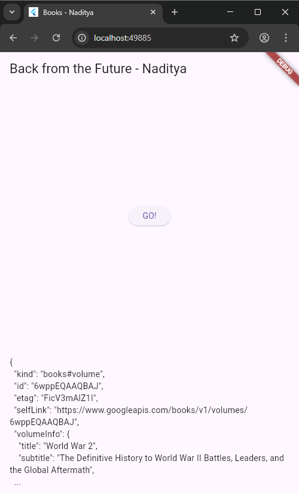
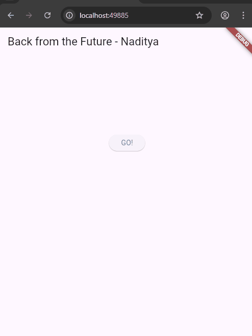
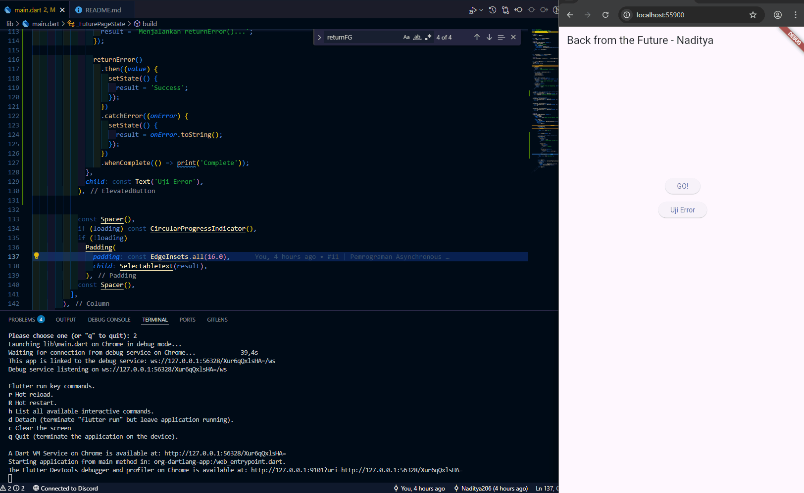
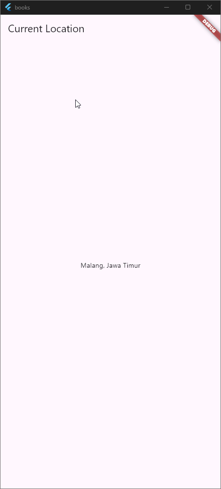

# 🧪 Laporan Praktikum Pemrograman Asynchronous di Flutter  
**Nama:** Naditya Prastia Andino  
**NIM:** 244107023008  
**No Absen:** 23  
**Kelas:** TI-3H  

---

## 📌 Soal Praktikum

### ✅ Soal 1  
Tambahkan nama panggilan Anda pada title app sebagai identitas hasil pekerjaan Anda.



### ✅ Soal 2  
Carilah judul buku favorit Anda di Google Books, lalu ganti ID buku pada variabel `path` di kode tersebut.  
Lakukan capture hasil JSON dan tulis di README  
Commit dengan pesan: `"W11: Soal 2"`


### ✅ Soal 3  
Jelaskan maksud kode pada langkah `ElevatedButton` terkait penggunaan `substring` dan `catchError`.  
Lampirkan hasil berupa GIF di README.  
Commit dengan pesan: `"W11: Soal 3"`

* **`substring(0, 300)`** digunakan untuk **memotong hasil data JSON** agar tidak terlalu panjang saat ditampilkan di layar (hanya menampilkan 300 karakter pertama).
* **`catchError`** digunakan untuk **menangani error** jika proses pengambilan data dari API gagal (misalnya karena koneksi atau URL salah), supaya aplikasi tidak crash dan menampilkan pesan kesalahan yang jelas.


---


## 📘 W11: Soal 4

### ✅ Penjelasan Langkah 1 dan 2

#### 🔹 Langkah 1: Membuat Tiga Fungsi Asynchronous
Pada langkah ini, dibuat tiga fungsi asynchronous:
```dart
Future<int> returnOneAsync() async {
  await Future.delayed(const Duration(seconds: 3));
  return 1;
}
Future<int> returnTwoAsync() async {
  await Future.delayed(const Duration(seconds: 3));
  return 2;
}
Future<int> returnThreeAsync() async {
  await Future.delayed(const Duration(seconds: 3));
  return 3;
}
```

**Tujuan:**  
Ketiga fungsi ini mensimulasikan proses asynchronous (misalnya pengambilan data dari server) dengan delay selama 3 detik, lalu mengembalikan nilai integer masing-masing.

---

#### 🔹 Langkah 2: Membuat Fungsi `count()`
Fungsi ini digunakan untuk memanggil ketiga fungsi asynchronous di atas secara berurutan dan menjumlahkan hasilnya.

```dart
Future<void> count() async {
  setState(() {
    loading = true;
    result = 'Menghitung total dari tiga async function...';
  });

  try {
    int total = 0;
    total = await returnOneAsync();
    total += await returnTwoAsync();
    total += await returnThreeAsync();

    setState(() {
      result = 'Total hasil: $total';
      loading = false;
    });
  } catch (e) {
    setState(() {
      result = 'Terjadi error saat menghitung: $e';
      loading = false;
    });
  }
}
```

**Tujuan:**  
- Menjalankan ketiga fungsi secara berurutan menggunakan `await`
- Menjumlahkan hasilnya ke dalam variabel `total`
- Menampilkan hasil ke UI melalui `setState`

---

### 🎥 Hasil Praktikum (GIF)
Berikut adalah hasil praktikum saat tombol `GO!` ditekan dan fungsi `count()` dijalankan:


---

## 🧠 W11: Soal 5

### ✅ Penjelasan Kode Langkah 2

Pada langkah ini, kita menambahkan sebuah variabel dan dua method ke dalam class `_FuturePageState` untuk mengelola proses asynchronous secara manual menggunakan `Completer`.

---

### 🔹 Kode yang Ditambahkan

```dart
late Completer completer;

Future getNumber() {
  completer = Completer<int>();
  calculate();
  return completer.future;
}

Future calculate() async {
  await Future.delayed(const Duration(seconds : 5));
  completer.complete(42);
}

```

### 🎥 Hasil Praktikum (GIF)
Berikut adalah hasil praktikum saat tombol `GO!` ditekan:


### ✅ Penjelasan Langkah 2

Pada langkah ini, kita menggunakan `Completer` untuk mengelola proses asynchronous secara manual.

#### 🔹 Kode yang Ditambahkan

```dart
late Completer completer;

Future getNumber() {
  completer = Completer<int>();
  calculate();
  return completer.future;
}

Future calculate() async {
  await Future.delayed(const Duration(seconds: 5));
  completer.complete(42);
}
```

### 🎥 Hasil Praktikum (GIF)
Berikut adalah hasil praktikum saat tombol `GO!` ditekan:



## 📘 W11: Soal 7

Capture hasil praktikum Anda berupa GIF dan lampirkan di README. Lalu lakukan commit dengan pesan "W11: Soal 7".

### 🎥 Hasil Praktikum (GIF)
Berikut adalah hasil praktikum saat tombol `GO!` ditekan:


Berikut penjelasan **Soal 8** dalam format **Markdown**, Naditya:

---

## 📘 W11: Soal 8

### ✅ Perbedaan Kode Langkah 1 dan Langkah 4

---

### 🔹 Langkah 1: Menggunakan `FutureGroup`

```dart
FutureGroup<int> futureGroup = FutureGroup<int>();
futureGroup.add(returnOneAsync());
futureGroup.add(returnTwoAsync());
futureGroup.add(returnThreeAsync());
futureGroup.close();

futureGroup.future.then((List<int> value) {
  // proses hasil
});
```

**Penjelasan:**
- `FutureGroup` digunakan untuk mengelola beberapa `Future` secara manual.
- Kita harus menambahkan setiap `Future` satu per satu menggunakan `.add()`.
- Setelah semua `Future` ditambahkan, kita harus memanggil `.close()` agar grup siap menunggu hasil.
- Cocok untuk kasus kompleks di mana `Future` ditambahkan secara dinamis atau bertahap.

---

### 🔹 Langkah 4: Menggunakan `Future.wait`

```dart
final futures = Future.wait<int>([
  returnOneAsync(),
  returnTwoAsync(),
  returnThreeAsync(),
]);

futures.then((List<int> value) {
  // proses hasil
});
```

**Penjelasan:**
- `Future.wait` langsung menerima list of `Future` dan menunggu semuanya selesai.
- Tidak perlu `.add()` atau `.close()`.
- Lebih ringkas dan efisien untuk kasus statis di mana semua `Future` sudah diketahui sejak awal.

---

### ⚖️ Perbandingan

| Aspek               | Langkah 1 (`FutureGroup`)                  | Langkah 4 (`Future.wait`)               |
|---------------------|--------------------------------------------|-----------------------------------------|
| Struktur            | Manual: `.add()` dan `.close()`            | Otomatis: langsung list `Future`        |
| Fleksibilitas       | Tinggi, bisa tambah `Future` bertahap      | Rendah, harus tahu semua `Future` awal  |
| Kompleksitas kode   | Lebih panjang dan eksplisit                | Lebih ringkas dan sederhana             |
| Cocok untuk         | Dinamis, event-driven                      | Statis, paralel sederhana               |

---

### 🎯 Kesimpulan

- Gunakan `FutureGroup` jika kamu perlu menambahkan `Future` secara bertahap atau berdasarkan kondisi runtime.
- Gunakan `Future.wait` jika semua `Future` sudah tersedia dan kamu ingin menjalankannya secara paralel dengan kode yang lebih ringkas.

## 📘 W11: Soal 9

Capture hasil praktikum Anda berupa GIF dan lampirkan di README. Lalu lakukan commit dengan pesan "W11: Soal 9".

### 🎥 Hasil Praktikum (GIF)
Berikut adalah hasil praktikum saat tombol `GO!` ditekan:



## 📘 W11: Soal 10

### ✅ Hasil Setelah Menjalankan `handleError()`
Ketika tombol `ElevatedButton` ditekan dan method `handleError()` dipanggil:
- Aplikasi menunggu 2 detik
- Kemudian menampilkan pesan error: `Exception: Something terrible happened!`
- Konsol mencetak: `Complete`

---

### 🔍 Perbedaan Langkah 1 dan Langkah 4

| Langkah | Teknik Penanganan | Penjelasan |
|--------|--------------------|------------|
| 1      | `.catchError()` + `.whenComplete()` | Penanganan error dilakukan setelah `Future` selesai |
| 4      | `try-catch` dalam `async` function | Penanganan error dilakukan langsung di dalam blok `try` |

**Kesimpulan:**  
Langkah 1 cocok untuk chaining `Future`, sedangkan Langkah 4 lebih fleksibel untuk logika kompleks dan penanganan terstruktur dalam satu blok.

### Jawaban Soal 12

Tidak, koordinat GPS **tidak muncul saat dijalankan di browser**.  
Hal ini karena **Flutter Web tidak memiliki akses langsung ke sensor GPS perangkat**, sehingga `geolocator` tidak dapat mengambil data lokasi fisik.  
Animasi loading ditampilkan selama 3 detik menggunakan:
```dart
await Future.delayed(const Duration(seconds: 3));
```

### 🎥 Hasil Praktikum (GIF)
Berikut adalah hasil praktikum:



## 🧭 Soal 13

### 💡 Pertanyaan
Apakah ada perbedaan UI dengan praktikum sebelumnya? Mengapa demikian?

### 💬 Jawaban
Ya, ada perbedaan pada UI.  
Pada praktikum sebelumnya, **animasi loading dan hasil lokasi diatur secara manual dengan `setState()`**, sedangkan pada praktikum ini digunakan **`FutureBuilder`** yang secara otomatis **merebuild UI** berdasarkan status `Future`.  

Dengan `FutureBuilder`, kode menjadi:
- Lebih **efisien** karena tidak perlu memanggil `setState()` berulang kali.  
- Lebih **clean dan reaktif**, karena UI langsung menyesuaikan status `Future` (loading, selesai, atau error).  

### 🎥 Hasil Praktikum (GIF)
Berikut adalah hasil praktikum:


## 🧭 Soal 14

### 💡 Pertanyaan
Apakah ada perbedaan UI dengan langkah sebelumnya? Mengapa demikian?

### 💬 Jawaban
Ya, terdapat perbedaan pada UI.  
Pada langkah sebelumnya, ketika terjadi error proses mendapatkan lokasi, UI mungkin kosong atau tetap menampilkan loading.  
Namun setelah **handling error ditambahkan**, kini UI menampilkan pesan teks:

### 🎥 Hasil Praktikum (GIF)
Berikut adalah hasil praktikum:


## 🧭 Soal 16

### 1\. Analisis Tombol

  * **Apa yang terjadi?**
    Saat tombol warna (misal: "Red") di Layar 2 ditekan, Layar 2 akan tertutup dan warna latar belakang di Layar 1 (yang awalnya kuning) berubah menjadi merah.

  * **Mengapa demikian?**
    Ini terjadi karena alur *Navigator* "push dan pop dengan data":

    1.  **Layar 1 (push):** Menggunakan `await Navigator.push(...)` untuk membuka Layar 2 dan *menunggu* data dikembalikan.
    2.  **Layar 2 (pop):** Menggunakan `Navigator.pop(context, Colors.red)` untuk menutup diri dan *mengirim* data `Colors.red` kembali ke Layar 1.
    3.  **Layar 1 (setState):** Menerima data warna tersebut, menyimpannya di variabel `color`, lalu memanggil `setState()` untuk memperbarui UI dengan warna baru.


## 🧭 Soal 17

Tentu, berikut adalah jawaban singkat untuk Soal 17.

### 1\. Analisis Tombol

  * **Apa yang terjadi?**
    Saat tombol "Change Color" ditekan, sebuah `AlertDialog` muncul di atas layar. Saat Anda memilih warna di dalam dialog (misal: "Biru Pastel"), dialog itu tertutup, dan warna latar belakang layar berubah menjadi Biru Pastel.

  * **Mengapa demikian?**
    Ini adalah alur *State Management* yang berbeda dari Soal 16:

    1.  Dialog (`AlertDialog`) dan Layar (`Scaffold`) berada dalam **State yang sama** (`_NavigationDialogScreenState`).
    2.  Saat tombol "Biru Pastel" di dialog ditekan, `onPressed`-nya **langsung mengubah** variabel `color` di dalam State.
    3.  `Navigator.pop(context)` kemudian dipanggil hanya untuk **menutup dialog**.
    4.  Kode di method `_showColorDialog` telah *menunggu* (`await`) di baris `showDialog`. Setelah dialog ditutup, eksekusi berlanjut.
    5.  Baris terakhir, `setState(() {})`, dieksekusi. Ini memberi tahu Flutter untuk **membangun ulang UI**, yang sekarang menggunakan nilai `color` yang sudah diperbarui.

