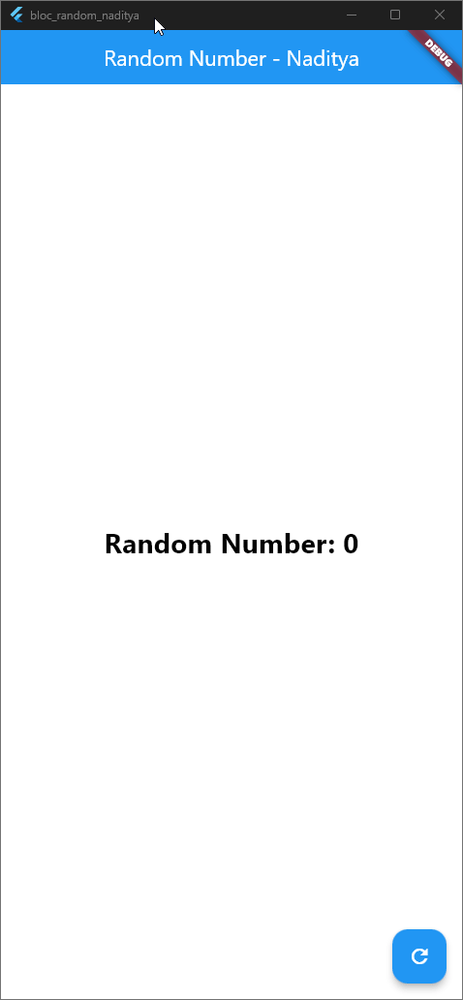

# Praktikum 7: BLoC Pattern

## ✅ Soal 13 – Penjelasan Praktikum dan Konsep Pola BLoC

### 📘 Maksud Praktikum

Praktikum ini bertujuan untuk:
- Memahami cara kerja **stream** dan **sink** dalam Flutter.
- Menerapkan **pola BLoC (Business Logic Component)** untuk memisahkan logika dari tampilan.
- Menggunakan `StreamBuilder` untuk membangun UI secara reaktif berdasarkan data dari stream.
- Mengelola data asinkron (angka acak) secara efisien dan terstruktur.

Setiap kali tombol ditekan, angka acak dikirim ke stream melalui sink, dan ditampilkan di UI secara otomatis.

---

### 🧠 Letak Konsep Pola BLoC

Pola BLoC diterapkan melalui struktur berikut:

| Komponen         | Letak Implementasi                                      | Fungsi                                                                 |
|------------------|---------------------------------------------------------|------------------------------------------------------------------------|
| **StreamController** | `random_bloc.dart` (`_streamController`)               | Mengelola aliran data (stream) dan input (sink).                       |
| **Sink**             | `generateRandom.add(...)` di `FloatingActionButton`   | Mengirim data ke stream.                                               |
| **Stream**           | `randomNumber` getter di `random_bloc.dart`           | Menyediakan data untuk didengarkan oleh UI.                            |
| **Listener/UI**      | `StreamBuilder` di `random_screen.dart`               | Menampilkan data dari stream secara real-time di tampilan aplikasi.    |
| **Dispose**          | `bloc.dispose()` di `random_screen.dart`              | Menutup stream saat widget dihancurkan agar tidak terjadi memory leak. |

Dengan pola ini, logika pembuatan angka acak dipisahkan dari tampilan, sehingga kode lebih modular, teruji, dan mudah dirawat.

---

### 📸 Hasil Praktikum

- Setiap kali tombol refresh ditekan, angka acak muncul di layar.
- UI dibangun ulang secara otomatis oleh `StreamBuilder`.

