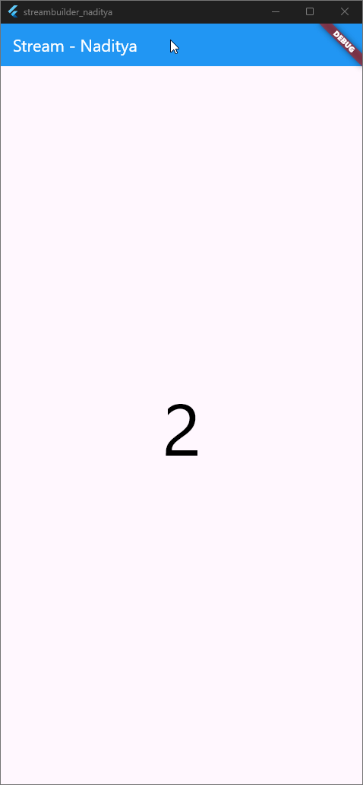

# Praktikum 6: StreamBuilder

## ✅ Soal 12 – StreamBuilder dan Inisialisasi Stream

### 📘 Penjelasan Langkah 3 dan 7

| Langkah | Kode / Konsep                                               | Penjelasan                                                                 |
|--------|--------------------------------------------------------------|----------------------------------------------------------------------------|
| 3      | `numberStream = NumberStream().getNumbers();`               | Inisialisasi stream dari class `NumberStream`. Method `getNumbers()` menghasilkan angka acak setiap detik menggunakan `Stream.periodic`. |
| 7      | `StreamBuilder(... builder: (context, snapshot) {...})`     | Widget `StreamBuilder` digunakan untuk membangun UI berdasarkan data dari stream. Setiap kali stream mengirim data baru, builder akan dipanggil ulang dan menampilkan angka terbaru di layar. |

---

### 🔍 Penjelasan Tambahan

- `Stream.periodic` menghasilkan angka acak setiap detik.
- `StreamBuilder` secara otomatis mendengarkan stream dan memperbarui tampilan saat data baru tersedia.
- `snapshot.hasData` memastikan bahwa data valid tersedia sebelum ditampilkan.
- `snapshot.data.toString()` digunakan untuk menampilkan angka di UI.

---

### 📸 Hasil Praktikum

- Setiap detik, angka baru muncul di layar secara otomatis.
- Tampilan menunjukkan angka besar berwarna putih dengan latar biru.

