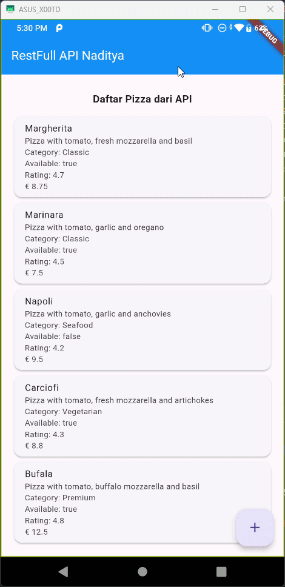

# Praktikum 1: Konversi Dart model ke JSON

### ✅ **Soal 1**

**Instruksi:**

-Tambahkan nama panggilan Anda pada title app sebagai identitas hasil pekerjaan Anda.
-Gantilah warna tema aplikasi sesuai kesukaan Anda.
-Capture hasil aplikasi Anda, lalu masukkan ke laporan di README dan lakukan commit hasil jawaban Soal 1 dengan pesan "W14: Jawaban Soal 1"

```bash
W14: Jawaban Soal 1
```

**Implementasi:**

- Title aplikasi diubah menjadi: `JSON Naditya`
- Warna tema aplikasi diubah menjadi: `Colors.blue`

```dart
MaterialApp(
  title: 'JSON Naditya',
  theme: ThemeData(
    primarySwatch: Colors.blue,
  ),
  home: const MyHomePage(),
)
```


---

### ✅ **Soal 2**

**Instruksi:**

- Tambahkan field baru dalam JSON maupun POST ke Wiremock!
- Capture hasil aplikasi Anda berupa GIF di README dan lakukan commit hasil jawaban Soal 2 dengan pesan "W14: Jawaban Soal 2"

```bash
W14: Jawaban Soal 2
```
Sebelum menambahkan 3 field baru


Setelah menambahkan 3 field baru




---
